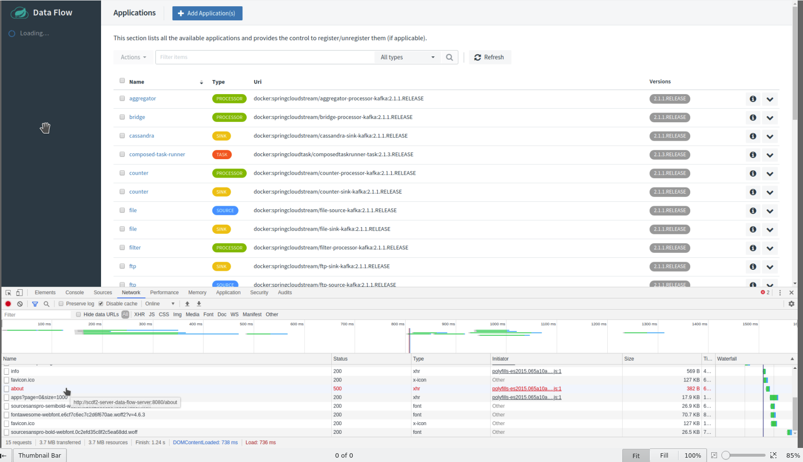
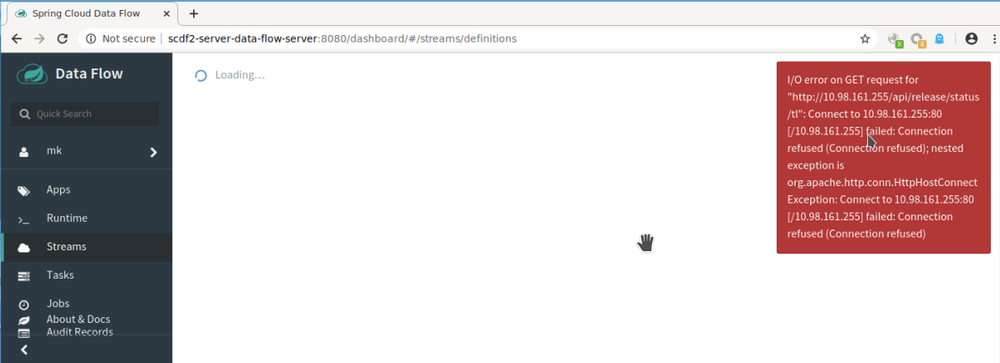

# Summary about deployment scdf 2.3.0 applying keycloak 8.0.1

I am deploying scdf23 and skipper using default deployment values.<br> 
Configuration obtained from `https://github.com/jvalkeal/randomstuff/blob/master/dataflow-uaa/docker-compose-oauth.yml#L67-L80` [jvalkeal-randomstuff](https://github.com/jvalkeal/randomstuff/blob/master/dataflow-uaa/docker-compose-oauth.yml#L67-L80)
 
*  The scdf-deployment values using keycloak needed to check: 

    1. Applying `SPRING_SECURITY_OAUTH2_CLIENT_PROVIDER_KEYCLOAK_USER_NAME_ATTRIBUTE` with value `'preferred_username'` as keycloak info shows.
    1. Applying `SPRING_SECURITY_OAUTH2_CLIENT_REGISTRATION_KEYCLOAK_CLIENT_NAME` with value `'<keycloak user defined>'`.
    1. Needed `SPRING_SECURITY_OAUTH2_AUTHORIZATION_CHECK_TOKEN_ACCESS` with value `'isAuthenticated()'`.

```
        - name: spring.cloud.dataflow.security.authorization.provider-role-mappings.keycloak.map-oauth-scopes
          value: 'true'
        - name: spring.cloud.dataflow.security.authorization.provider-role-mappings.keycloak.role-mappings.ROLE_CREATE
          value: 'dataflow.create'
        - name: spring.cloud.dataflow.security.authorization.provider-role-mappings.keycloak.role-mappings.ROLE_DEPLOY
          value: 'dataflow.deploy'
        - name: spring.cloud.dataflow.security.authorization.provider-role-mappings.keycloak.role-mappings.ROLE_MODIFY
          value: 'dataflow.modify'
        - name: spring.cloud.dataflow.security.authorization.provider-role-mappings.keycloak.role-mappings.ROLE_MANAGE
          value: 'dataflow.manage'
        - name: spring.cloud.dataflow.security.authorization.provider-role-mappings.keycloak.role-mappings.ROLE_SCHEDULE
          value: 'dataflow.schedule'
        - name: spring.cloud.dataflow.security.authorization.provider-role-mappings.keycloak.role-mappings.ROLE_DESTROY
          value: 'dataflow.destroy'
        - name: spring.cloud.dataflow.security.authorization.provider-role-mappings.keycloak.role-mappings.ROLE_VIEW
          value: 'dataflow.view'
        - name: spring.cloud.dataflow.security.authorization.provider-role-mappings.keycloak.map-oauth-scopes
          value: 'true'
        - name: SPRING_SECURITY_OAUTH2_CLIENT_REGISTRATION_KEYCLOAK_REDIRECT_URI
          value: '{baseUrl}/login/oauth2/code/{registrationId}'
        - name: SPRING_SECURITY_OAUTH2_CLIENT_REGISTRATION_KEYCLOAK_AUTHORIZATION_GRANT_TYPE
          value: 'authorization_code'
        - name: SPRING_SECURITY_OAUTH2_CLIENT_REGISTRATION_KEYCLOAK_CLIENT_NAME
          value: 'mk'
        - name: SPRING_SECURITY_OAUTH2_CLIENT_REGISTRATION_KEYCLOAK_CLIENT_ID
          value: 'dataflow'
        - name: SPRING_SECURITY_OAUTH2_CLIENT_REGISTRATION_KEYCLOAK_CLIENT_SECRET
          value: '99fad78e-20f0-4b91-bcaf-0324e34ddf71'       
        - name: SPRING_SECURITY_OAUTH2_CLIENT_REGISTRATION_KEYCLOAK_SCOPE
          value: 'openid,dataflow.create,dataflow.deploy,dataflow.destroy,dataflow.manage,dataflow.modify,dataflow.schedule,dataflow.view'
        - name: SPRING_SECURITY_OAUTH2_CLIENT_PROVIDER_KEYCLOAK_JWK_SET_URI
          value: 'http://keycloak-http:8844/auth/realms/master/protocol/openid-connect/certs'        
        - name: SPRING_SECURITY_OAUTH2_CLIENT_PROVIDER_KEYCLOAK_TOKEN_URI
          value: 'http://keycloak-http:8844/auth/realms/master/protocol/openid-connect/token'
        - name: SPRING_SECURITY_OAUTH2_CLIENT_PROVIDER_KEYCLOAK_USER_INFO_URI
          value: 'http://keycloak-http:8844/auth/realms/master/protocol/openid-connect/userinfo'
        - name: SPRING_SECURITY_OAUTH2_CLIENT_PROVIDER_KEYCLOAK_USER_NAME_ATTRIBUTE
          value: 'preferred_username'         
        - name: SPRING_SECURITY_OAUTH2_CLIENT_PROVIDER_KEYCLOAK_AUTHORIZATION_URI
          value: 'http://keycloak-http:8844/auth/realms/master/protocol/openid-connect/auth'         
        - name: SPRING_SECURITY_OAUTH2_RESOURCESERVER_OPAQUETOKEN_INTROSPECTION_URI
          value: 'http://keycloak-http:8844/auth/realms/master/protocol/openid-connect/token/introspect'         
        - name: SPRING_SECURITY_OAUTH2_RESOURCESERVER_OPAQUETOKEN_CLIENT_ID
          value: 'dataflow'
        - name: SPRING_SECURITY_OAUTH2_RESOURCESERVER_OPAQUETOKEN_CLIENT_SECRET
          value: '99fad78e-20f0-4b91-bcaf-0324e34ddf71'         
        - name: SPRING_SECURITY_OAUTH2_AUTHORIZATION_CHECK_TOKEN_ACCESS
          value: 'isAuthenticated()'
```
       


*  The skipper-deployment values using keycloak needed to check (all values are the same to scdf except):
    1. Be sure that you dont apply `SPRING_SECURITY_OAUTH2_AUTHORIZATION_CHECK_TOKEN_ACCESS` with value `'isAuthenticated()'`.
    
    
* All config about rules and roles are default values ... nothing changed or updated ...
* At this moment, using the same client to keycloak ... `dataflow`, maybe, using diffentes clients is a best practice

**I got two problems to fix**

* Something related with `/about` access.<br>
Something, access to `/about/` is forbidden.<br> 
I think is something about `isAuthorized()` properties, because, if it configures in skipper, fails always. 



log info from skipper shows: <br>

```
2020-01-17 16:40:01.250 DEBUG 1 --- [nio-7577-exec-4] o.s.s.w.u.matcher.AntPathRequestMatcher  : Request -GET /api/about- doesnt match -DELETE /logout----
2020-01-17 16:40:01.250 DEBUG 1 --- [nio-7577-exec-4] o.s.s.web.util.matcher.OrRequestMatcher  : No matches found
2020-01-17 16:40:01.250 DEBUG 1 --- [nio-7577-exec-4] o.s.security.web.FilterChainProxy        : /api/about at position 5 of 13 in additional filter chain; firing Filter: -BearerTokenAuthenticationFilter-
2020-01-17 16:40:01.251 DEBUG 1 --- [nio-7577-exec-4] o.s.s.authentication.ProviderManager     : Authentication attempt using org.springframework.security.oauth2.server.resource.authentication.OpaqueTokenAuthenticationProvider
2020-01-17 16:40:01.257 DEBUG 1 --- [nio-7577-exec-4] .s.a.DefaultAuthenticationEventPublisher : No event was found for the exception org.springframework.security.oauth2.core.OAuth2AuthenticationException
2020-01-17 16:40:01.258 DEBUG 1 --- [nio-7577-exec-4] .o.s.r.w.BearerTokenAuthenticationFilter : Authentication request for failed!
org.springframework.security.oauth2.core.OAuth2AuthenticationException: Provided token [eyJhbGciOiJSUzI1NiIsInR5cCIgOiAiSldUIiwia2lkIiA6ICIyUWlyQi14SEdUb2wxSlBtbkFjbVVFS1JOREN0V2pSeXVrTERac25QZlJ3In0.eyJqdGkiOiJjZTM1NDExNC1mZWVmLTQ5M2EtOTAxZS00MzZiNmQ0MGVmNjMiLCJleHAiOjE1NzkyNzU0NzgsIm5iZiI6MCwiaWF0IjoxNTc5Mjc1NDE4LCJpc3MiOiJodHRwOi8va2V5Y2xvYWstaHR0cDo4ODQ0L2F1dGgvcmVhbG1zL21hc3RlciIsImF1ZCI6ImFjY291bnQiLCJzdWIiOiI2ODI1YmE5Yi0zYzEzLTQ4MWItYmUwMC0zYjA0ZWQ5YmJlZWEiLCJ0eXAiOiJCZWFyZXIiLCJhenAiOiJkYXRhZmxvdyIsIm5vbmNlIjoiNUNYTy1XODJNeUU5VEQ5eG9rcnZpM3ltVl8zN285ZVlKdWZkcVlNYTR0byIsImF1dGhfdGltZSI6MTU3OTI3NTQxOCwic2Vzc2lvbl9zdGF0ZSI6ImFlZGEzYTI2LWU5MzItNGQyZS04MmY1LTNjZTlmZTQ0N2I0ZSIsImFjciI6IjEiLCJyZWFsbV9hY2Nlc3MiOnsicm9sZXMiOlsib2ZmbGluZV9hY2Nlc3MiLCJ1bWFfYXV0aG9yaXphdGlvbiIsInNjZGYtcm9sZSJdfSwicmVzb3VyY2VfYWNjZXNzIjp7ImFjY291bnQiOnsicm9sZXMiOlsibWFuYWdlLWFjY291bnQiLCJtYW5hZ2UtYWNjb3VudC1saW5rcyIsInZpZXctcHJvZmlsZSJdfX0sInNjb3BlIjoib3BlbmlkIGRhdGFmbG93LmRlc3Ryb3kgcHJvZmlsZSBlbWFpbCBkYXRhZmxvdy5tYW5hZ2UgZGF0YWZsb3cuc2NoZWR1bGUgZGF0YWZsb3cuY3JlYXRlIGRhdGFmbG93LmRlcGxveSBkYXRhZmxvdy52aWV3IGRhdGFmbG93Lm1vZGlmeSIsImVtYWlsX3ZlcmlmaWVkIjpmYWxzZSwicHJlZmVycmVkX3VzZXJuYW1lIjoibWsifQ.Vzsl7mCcMEH-aWRA3yPmWDxZZYFN_s8B8PUt6CUkaGP25RiLRHCIoKbpO1BqXvbwncyR2WwYlVWpk8YNZu8FqyQIbPXjWrCn5_FOjPLMd0KEPMB5uZkuHEZgkMMVUgYfOsEBXJRkyqoGqa00tzna7ORymx78i2b9hHoCdQBG5cENIuJu-wkVcBztjkbgq-hgRn_88MMLUVzQurMUoyote6ZPoUW4m8g-IKZi1_bgkvechaFRgexdvGFMfGRzf3HTmKt36-BK1h7jU-7JEkICHyw4KYuhfF9rIMoXm1cgdUftZhGTK6deG83yZmrOwBqjVCVxWLKc9c3HZzgTAgTzOg] isnt active
        at org.springframework.security.oauth2.server.resource.authentication.OpaqueTokenAuthenticationProvider.authenticate(OpaqueTokenAuthenticationProvider.java:99) ~[spring-security-oauth2-resource-server-5.2.1.RELEASE.jar!/:5.2.1.RELEASE]
        at org.springframework.security.authentication.ProviderManager.authenticate(ProviderManager.java:175) ~[spring-security-core-5.2.1.RELEASE.jar!/:5.2.1.RELEASE]
        at org.springframework.security.oauth2.server.resource.web.BearerTokenAuthenticationFilter.doFilterInternal(BearerTokenAuthenticationFilter.java:124) ~[spring-security-oauth2-resource-server-5.2.1.RELEASE.jar!/:5.2.1.RELEASE]
        at org.springframework.web.filter.OncePerRequestFilter.doFilter(OncePerRequestFilter.java:119) [spring-web-5.2.1.RELEASE.jar!/:5.2.1.RELEASE]
        at org.springframework.security.web.FilterChainProxy$VirtualFilterChain.doFilter(FilterChainProxy.java:334) [spring-security-web-5.2.1.RELEASE.jar!/:5.2.1.RELEASE]
        at org.springframework.security.web.authentication.logout.LogoutFilter.doFilter(LogoutFilter.java:116) [spring-security-web-5.2.1.RELEASE.jar!/:5.2.1.RELEASE]
        at org.springframework.security.web.FilterChainProxy$VirtualFilterChain.doFilter(FilterChainProxy.java:334) [spring-security-web-5.2.1.RELEASE.jar!/:5.2.1.RELEASE]
        
```


* Dashboard streaming doesn't work.<br>

Using stream from dashboard, you get :




logging info is:

```

2020-01-17 16:45:56.106 DEBUG 1 --- [nio-7577-exec-4] o.s.security.web.FilterChainProxy        : /api/release/status/tl at position 3 of 13 in additional filter chain; firing Filter: 'HeaderWriterFilter'
2020-01-17 16:45:56.106 DEBUG 1 --- [nio-7577-exec-4] o.s.security.web.FilterChainProxy        : /api/release/status/tl at position 4 of 13 in additional filter chain; firing Filter: 'LogoutFilter'
2020-01-17 16:45:56.107 DEBUG 1 --- [nio-7577-exec-4] o.s.s.web.util.matcher.OrRequestMatcher  : Trying to match using Ant [pattern='/logout', GET]
2020-01-17 16:45:56.107 DEBUG 1 --- [nio-7577-exec-4] o.s.s.w.u.matcher.AntPathRequestMatcher  : Checking match of request : '/api/release/status/tl'; against '/logout'
2020-01-17 16:45:56.107 DEBUG 1 --- [nio-7577-exec-4] o.s.s.web.util.matcher.OrRequestMatcher  : Trying to match using Ant [pattern='/logout', POST]
2020-01-17 16:45:56.107 DEBUG 1 --- [nio-7577-exec-4] o.s.s.w.u.matcher.AntPathRequestMatcher  : Request 'GET /api/release/status/tl' doesn---t match 'POST /logout'
2020-01-17 16:45:56.107 DEBUG 1 --- [nio-7577-exec-4] o.s.s.web.util.matcher.OrRequestMatcher  : Trying to match using Ant [pattern='/logout', PUT]
2020-01-17 16:45:56.107 DEBUG 1 --- [nio-7577-exec-4] o.s.s.w.u.matcher.AntPathRequestMatcher  : Request 'GET /api/release/status/tl' doesn---t match 'PUT /logout'
2020-01-17 16:45:56.107 DEBUG 1 --- [nio-7577-exec-4] o.s.s.web.util.matcher.OrRequestMatcher  : Trying to match using Ant [pattern='/logout', DELETE]
2020-01-17 16:45:56.107 DEBUG 1 --- [nio-7577-exec-4] o.s.s.w.u.matcher.AntPathRequestMatcher  : Request 'GET /api/release/status/tl' doesn---t match 'DELETE /logout'
2020-01-17 16:45:56.107 DEBUG 1 --- [nio-7577-exec-4] o.s.s.web.util.matcher.OrRequestMatcher  : No matches found
2020-01-17 16:45:56.107 DEBUG 1 --- [nio-7577-exec-4] o.s.security.web.FilterChainProxy        : /api/release/status/tl at position 5 of 13 in additional filter chain; firing Filter: 'BearerTokenAuthenticationFilter'
2020-01-17 16:45:56.109 DEBUG 1 --- [nio-7577-exec-4] o.s.s.authentication.ProviderManager     : Authentication attempt using org.springframework.security.oauth2.server.resource.authentication.OpaqueTokenAuthenticationProvider
2020-01-17 16:45:56.117 DEBUG 1 --- [nio-7577-exec-4] .s.a.DefaultAuthenticationEventPublisher : No event was found for the exception org.springframework.security.oauth2.core.OAuth2AuthenticationException
2020-01-17 16:45:56.118 DEBUG 1 --- [nio-7577-exec-4] .o.s.r.w.BearerTokenAuthenticationFilter : Authentication request for failed!
org.springframework.security.oauth2.core.OAuth2AuthenticationException: Provided token [eyJhbGciOiJSUzI1NiIsInR5cCIgOiAiSldUIiwia2lkIiA6ICIyUWlyQi14SEdUb2wxSlBtbkFjbVVFS1JOREN0V2pSeXVrTERac25QZlJ3In0.eyJqdGkiOiIxMGIwNzYyMC0xYjJkLTQ0NmUtOTBiNC1mMmM0YWMzZjE1NTciLCJleHAiOjE1NzkyNzU4NzgsIm5iZiI6MCwiaWF0IjoxNTc5Mjc1ODE4LCJpc3MiOiJodHRwOi8va2V5Y2xvYWstaHR0cDo4ODQ0L2F1dGgvcmVhbG1zL21hc3RlciIsImF1ZCI6ImFjY291bnQiLCJzdWIiOiI2ODI1YmE5Yi0zYzEzLTQ4MWItYmUwMC0zYjA0ZWQ5YmJlZWEiLCJ0eXAiOiJCZWFyZXIiLCJhenAiOiJkYXRhZmxvdyIsIm5vbmNlIjoiR2F6M2lwMXpObjFsVlA4dnBxSm4yeEZyb1o0bmFMcEwxNktxeXotd0U2TSIsImF1dGhfdGltZSI6MTU3OTI3NTgxOCwic2Vzc2lvbl9zdGF0ZSI6ImVjODkzN2ZjLWY5MTQtNGI3Yi1iMmIzLTllMjRkNWRkY2Q1OCIsImFjciI6IjEiLCJyZWFsbV9hY2Nlc3MiOnsicm9sZXMiOlsib2ZmbGluZV9hY2Nlc3MiLCJ1bWFfYXV0aG9yaXphdGlvbiIsInNjZGYtcm9sZSJdfSwicmVzb3VyY2VfYWNjZXNzIjp7ImFjY291bnQiOnsicm9sZXMiOlsibWFuYWdlLWFjY291bnQiLCJtYW5hZ2UtYWNjb3VudC1saW5rcyIsInZpZXctcHJvZmlsZSJdfX0sInNjb3BlIjoib3BlbmlkIGRhdGFmbG93LmRlc3Ryb3kgcHJvZmlsZSBlbWFpbCBkYXRhZmxvdy5tYW5hZ2UgZGF0YWZsb3cuc2NoZWR1bGUgZGF0YWZsb3cuY3JlYXRlIGRhdGFmbG93LmRlcGxveSBkYXRhZmxvdy52aWV3IGRhdGFmbG93Lm1vZGlmeSIsImVtYWlsX3ZlcmlmaWVkIjpmYWxzZSwicHJlZmVycmVkX3VzZXJuYW1lIjoibWsifQ.Rf5-W1pBODWrbCGI6xPmPe9k9Di8Qs7mkZjBLzGszXHybysyowl2sd5ctt6xXQR5wkxMLG3yB-N2La1i2YwiKJMnvUIh8BcM2i9ssOKkETlD0D_R5NyfNKmy7WnyJfmuQp9kgdAV1C9UG2vh7FC93WAoGNp4uqQAJvo20wESX9_IJUp23e2m-VHVK-CDUI_Ux3zngTZR2dHOL-DpMBt9uqxAhTQSgkY46-YnpNZ8Yt1aA1uQrPSFljfSerJrFJ5dMr7MNHem2IVlTNjf5fuJM6uaWKMeoh6d3WSjhBhqCeYSg7OwSwaztnRpZYMjIQ_z7VN4hSDRQGTxZVtq3Ll4QQ] isn---t active
        at org.springframework.security.oauth2.server.resource.authentication.OpaqueTokenAuthenticationProvider.authenticate(OpaqueTokenAuthenticationProvider.java:99) ~[spring-security-oauth2-resource-server-5.2.1.RELEASE.jar!/:5.2.1.RELEASE]
        at org.springframework.security.authentication.ProviderManager.authenticate(ProviderManager.java:175) ~[spring-security-core-5.2.1.RELEASE.jar!/:5.2.1.RELEASE]
        at org.springframework.security.oauth2.server.resource.web.BearerTokenAuthenticationFilter.doFilterInternal(BearerTokenAuthenticationFilter.java:124) ~[spring-security-oauth2-resource-server-5.2.1.RELEASE.jar!/:5.2.1.RELEASE]
        at org.springframework.web.filter.OncePerRequestFilter.doFilter(OncePerRequestFilter.java:119) [spring-web-5.2.1.RELEASE.jar!/:5.2.1.RELEASE]
        at org.springframework.security.web.FilterChainProxy$VirtualFilterChain.doFilter(FilterChainProxy.java:334) [spring-security-web-5.2.1.RELEASE.jar!/:5.2.1.RELEASE]
        at org.springframework.security.web.authentication.logout.LogoutFilter.doFilter(LogoutFilter.java:116) [spring-security-web-5.2.1.RELEASE.jar!/:5.2.1.RELEASE]
        at org.springframework.security.web.FilterChainProxy$VirtualFilterChain.doFilter(FilterChainProxy.java:334) [spring-security-web-5.2.1.RELEASE.jar!/:5.2.1.RELEASE]
        at org.springframework.security.web.header.HeaderWriterFilter.doHeadersAfter(HeaderWriterFilter.java:92) [spring-security-web-5.2.1.RELEASE.jar!/:5.2.1.RELEASE]
        at org.springframework.security.web.header.HeaderWriterFilter.doFilterInternal(HeaderWriterFilter.java:77) [spring-security-web-5.2.1.RELEASE.jar!/:5.2.1.RELEASE]
        at org.springframework.web.filter.OncePerRequestFilter.doFilter(OncePerRequestFilter.java:119) [spring-web-5.2.1.RELEASE.jar!/:5.2.1.RELEASE]
        at org.springframework.security.web.FilterChainProxy$VirtualFilterChain.doFilter(FilterChainProxy.java:334) [spring-security-web-5.2.1.RELEASE.jar!/:5.2.1.RELEASE]
        at org.springframework.security.web.context.SecurityContextPersistenceFilter.doFilter(SecurityContextPersistenceFilter.java:105) [spring-security-web-5.2.1.RELEASE.jar!/:5.2.1.RELEASE]
        at org.springframework.security.web.FilterChainProxy$VirtualFilterChain.doFilter(FilterChainProxy.java:334) [spring-security-web-5.2.1.RELEASE.jar!/:5.2.1.RELEASE]
        at org.springframework.security.web.context.request.async.WebAsyncManagerIntegrationFilter.doFilterInternal(WebAsyncManagerIntegrationFilter.java:56) [spring-security-web-5.2.1.RELEASE.jar!/:5.2.1.RELEASE]
        at org.springframework.web.filter.OncePerRequestFilter.doFilter(OncePerRequestFilter.java:119) [spring-web-5.2.1.RELEASE.jar!/:5.2.1.RELEASE]
        at org.springframework.security.web.FilterChainProxy$VirtualFilterChain.doFilter(FilterChainProxy.java:334) [spring-security-web-5.2.1.RELEASE.jar!/:5.2.1.RELEASE]
        at org.springframework.security.web.FilterChainProxy.doFilterInternal(FilterChainProxy.java:215) [spring-security-web-5.2.1.RELEASE.jar!/:5.2.1.RELEASE]
        at org.springframework.security.web.FilterChainProxy.doFilter(FilterChainProxy.java:178) [spring-security-web-5.2.1.RELEASE.jar!/:5.2.1.RELEASE]
        at org.springframework.web.filter.DelegatingFilterProxy.invokeDelegate(DelegatingFilterProxy.java:358) [spring-web-5.2.1.RELEASE.jar!/:5.2.1.RELEASE]
        at org.springframework.web.filter.DelegatingFilterProxy.doFilter(DelegatingFilterProxy.java:271) [spring-web-5.2.1.RELEASE.jar!/:5.2.1.RELEASE]
        at org.apache.catalina.core.ApplicationFilterChain.internalDoFilter(ApplicationFilterChain.java:193) [tomcat-embed-core-9.0.27.jar!/:9.0.27]
        at org.apache.catalina.core.ApplicationFilterChain.doFilter(ApplicationFilterChain.java:166) [tomcat-embed-core-9.0.27.jar!/:9.0.27]
        at org.springframework.web.filter.RequestContextFilter.doFilterInternal(RequestContextFilter.java:100) [spring-web-5.2.1.RELEASE.jar!/:5.2.1.RELEASE]
        at org.springframework.web.filter.OncePerRequestFilter.doFilter(OncePerRequestFilter.java:119) [spring-web-5.2.1.RELEASE.jar!/:5.2.1.RELEASE]
        at org.apache.catalina.core.ApplicationFilterChain.internalDoFilter(ApplicationFilterChain.java:193) [tomcat-embed-core-9.0.27.jar!/:9.0.27]
        at org.apache.catalina.core.ApplicationFilterChain.doFilter(ApplicationFilterChain.java:166) [tomcat-embed-core-9.0.27.jar!/:9.0.27]
        at org.springframework.web.filter.FormContentFilter.doFilterInternal(FormContentFilter.java:93) [spring-web-5.2.1.RELEASE.jar!/:5.2.1.RELEASE]
        at org.springframework.web.filter.OncePerRequestFilter.doFilter(OncePerRequestFilter.java:119) [spring-web-5.2.1.RELEASE.jar!/:5.2.1.RELEASE]
        at org.apache.catalina.core.ApplicationFilterChain.internalDoFilter(ApplicationFilterChain.java:193) [tomcat-embed-core-9.0.27.jar!/:9.0.27]
        at org.apache.catalina.core.ApplicationFilterChain.doFilter(ApplicationFilterChain.java:166) [tomcat-embed-core-9.0.27.jar!/:9.0.27]
        at org.springframework.boot.actuate.metrics.web.servlet.WebMvcMetricsFilter.doFilterInternal(WebMvcMetricsFilter.java:108) [spring-boot-actuator-2.2.1.RELEASE.jar!/:2.2.1.RELEASE]
        at org.springframework.web.filter.OncePerRequestFilter.doFilter(OncePerRequestFilter.java:119) [spring-web-5.2.1.RELEASE.jar!/:5.2.1.RELEASE]
```

At this point, it seems that both of them got `Authentication request for failed!` problem.
I am going to create a skipper client into keycloak and test again.

Tx

    