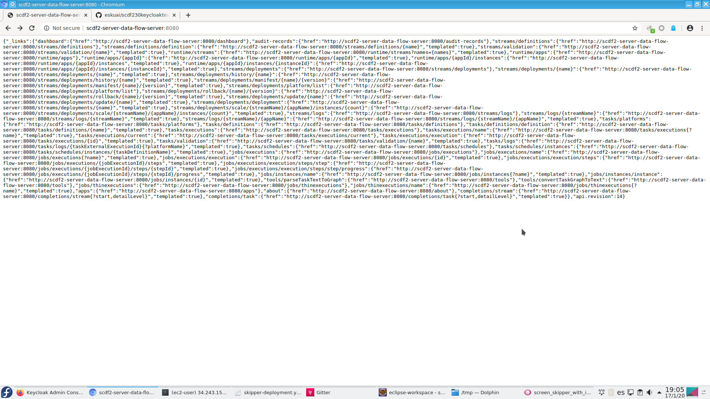

# Summary about deployment scdf 2.3.0 applying keycloak 8.0.1

I am deploying scdf23 and skipper using default deployment values.<br> 
Configuration obtained from `https://github.com/jvalkeal/randomstuff/blob/master/dataflow-uaa/docker-compose-oauth.yml#L67-L80` [jvalkeal-randomstuff](https://github.com/jvalkeal/randomstuff/blob/master/dataflow-uaa/docker-compose-oauth.yml#L67-L80)
 
*  The scdf-deployment values using keycloak needed to check: 

    1. Applying `SPRING_SECURITY_OAUTH2_CLIENT_PROVIDER_KEYCLOAK_USER_NAME_ATTRIBUTE` with value `'preferred_username'` as keycloak info shows.
    1. Applying `SPRING_SECURITY_OAUTH2_CLIENT_REGISTRATION_KEYCLOAK_CLIENT_NAME` with value `'<keycloak user defined>'`.
    1. Needed `SPRING_SECURITY_OAUTH2_AUTHORIZATION_CHECK_TOKEN_ACCESS` with value `'isAuthenticated()'`.

```
        - name: spring.cloud.dataflow.security.authorization.provider-role-mappings.keycloak.map-oauth-scopes
          value: 'true'
        - name: spring.cloud.dataflow.security.authorization.provider-role-mappings.keycloak.role-mappings.ROLE_CREATE
          value: 'dataflow.create'
        - name: spring.cloud.dataflow.security.authorization.provider-role-mappings.keycloak.role-mappings.ROLE_DEPLOY
          value: 'dataflow.deploy'
        - name: spring.cloud.dataflow.security.authorization.provider-role-mappings.keycloak.role-mappings.ROLE_MODIFY
          value: 'dataflow.modify'
        - name: spring.cloud.dataflow.security.authorization.provider-role-mappings.keycloak.role-mappings.ROLE_MANAGE
          value: 'dataflow.manage'
        - name: spring.cloud.dataflow.security.authorization.provider-role-mappings.keycloak.role-mappings.ROLE_SCHEDULE
          value: 'dataflow.schedule'
        - name: spring.cloud.dataflow.security.authorization.provider-role-mappings.keycloak.role-mappings.ROLE_DESTROY
          value: 'dataflow.destroy'
        - name: spring.cloud.dataflow.security.authorization.provider-role-mappings.keycloak.role-mappings.ROLE_VIEW
          value: 'dataflow.view'
        - name: spring.cloud.dataflow.security.authorization.provider-role-mappings.keycloak.map-oauth-scopes
          value: 'true'
        - name: SPRING_SECURITY_OAUTH2_CLIENT_REGISTRATION_KEYCLOAK_REDIRECT_URI
          value: '{baseUrl}/login/oauth2/code/{registrationId}'
        - name: SPRING_SECURITY_OAUTH2_CLIENT_REGISTRATION_KEYCLOAK_AUTHORIZATION_GRANT_TYPE
          value: 'authorization_code'
        - name: SPRING_SECURITY_OAUTH2_CLIENT_REGISTRATION_KEYCLOAK_CLIENT_NAME
          value: 'mk'
        - name: SPRING_SECURITY_OAUTH2_CLIENT_REGISTRATION_KEYCLOAK_CLIENT_ID
          value: 'dataflow'
        - name: SPRING_SECURITY_OAUTH2_CLIENT_REGISTRATION_KEYCLOAK_CLIENT_SECRET
          value: '99fad78e-20f0-4b91-bcaf-0324e34ddf71'       
        - name: SPRING_SECURITY_OAUTH2_CLIENT_REGISTRATION_KEYCLOAK_SCOPE
          value: 'openid,dataflow.create,dataflow.deploy,dataflow.destroy,dataflow.manage,dataflow.modify,dataflow.schedule,dataflow.view'
        - name: SPRING_SECURITY_OAUTH2_CLIENT_PROVIDER_KEYCLOAK_JWK_SET_URI
          value: 'http://keycloak-http:8844/auth/realms/master/protocol/openid-connect/certs'        
        - name: SPRING_SECURITY_OAUTH2_CLIENT_PROVIDER_KEYCLOAK_TOKEN_URI
          value: 'http://keycloak-http:8844/auth/realms/master/protocol/openid-connect/token'
        - name: SPRING_SECURITY_OAUTH2_CLIENT_PROVIDER_KEYCLOAK_USER_INFO_URI
          value: 'http://keycloak-http:8844/auth/realms/master/protocol/openid-connect/userinfo'
        - name: SPRING_SECURITY_OAUTH2_CLIENT_PROVIDER_KEYCLOAK_USER_NAME_ATTRIBUTE
          value: 'preferred_username'         
        - name: SPRING_SECURITY_OAUTH2_CLIENT_PROVIDER_KEYCLOAK_AUTHORIZATION_URI
          value: 'http://keycloak-http:8844/auth/realms/master/protocol/openid-connect/auth'         
        - name: SPRING_SECURITY_OAUTH2_RESOURCESERVER_OPAQUETOKEN_INTROSPECTION_URI
          value: 'http://keycloak-http:8844/auth/realms/master/protocol/openid-connect/token/introspect'         
        - name: SPRING_SECURITY_OAUTH2_RESOURCESERVER_OPAQUETOKEN_CLIENT_ID
          value: 'dataflow'
        - name: SPRING_SECURITY_OAUTH2_RESOURCESERVER_OPAQUETOKEN_CLIENT_SECRET
          value: '99fad78e-20f0-4b91-bcaf-0324e34ddf71'         
        - name: SPRING_SECURITY_OAUTH2_AUTHORIZATION_CHECK_TOKEN_ACCESS
          value: 'isAuthenticated()'
```
       


*  The skipper-deployment values using keycloak needed to check (all values are the same to scdf except):
    1. Be sure that you dont apply `SPRING_SECURITY_OAUTH2_AUTHORIZATION_CHECK_TOKEN_ACCESS` with value `'isAuthenticated()'`.
    
    
* All config about rules and roles are default values ... nothing changed or updated ...
* At this moment, using the same client to keycloak ... `dataflow`, maybe, using diffentes clients is a best practice

**I got two problems to fix**

* Something related with `/about` access.<br>
Something, access to `/about/` is forbidden.<br> 
I think is something about `isAuthorized()` properties, because, if it configures in skipper, fails always. 


log info from skipper shows: <br>

```
2020-01-17 16:40:01.250 DEBUG 1 --- [nio-7577-exec-4] o.s.s.w.u.matcher.AntPathRequestMatcher  : Request -GET /api/about- doesnt match -DELETE /logout----
2020-01-17 16:40:01.250 DEBUG 1 --- [nio-7577-exec-4] o.s.s.web.util.matcher.OrRequestMatcher  : No matches found
2020-01-17 16:40:01.250 DEBUG 1 --- [nio-7577-exec-4] o.s.security.web.FilterChainProxy        : /api/about at position 5 of 13 in additional filter chain; firing Filter: -BearerTokenAuthenticationFilter-
2020-01-17 16:40:01.251 DEBUG 1 --- [nio-7577-exec-4] o.s.s.authentication.ProviderManager     : Authentication attempt using org.springframework.security.oauth2.server.resource.authentication.OpaqueTokenAuthenticationProvider
2020-01-17 16:40:01.257 DEBUG 1 --- [nio-7577-exec-4] .s.a.DefaultAuthenticationEventPublisher : No event was found for the exception org.springframework.security.oauth2.core.OAuth2AuthenticationException
2020-01-17 16:40:01.258 DEBUG 1 --- [nio-7577-exec-4] .o.s.r.w.BearerTokenAuthenticationFilter : Authentication request for failed!
org.springframework.security.oauth2.core.OAuth2AuthenticationException: Provided token [eyJhbGciOiJSUzI1NiIsInR5cCIgOiAiSldUIiwia2lkIiA6ICIyUWlyQi14SEdUb2wxSlBtbkFjbVVFS1JOREN0V2pSeXVrTERac25QZlJ3In0.eyJqdGkiOiJjZTM1NDExNC1mZWVmLTQ5M2EtOTAxZS00MzZiNmQ0MGVmNjMiLCJleHAiOjE1NzkyNzU0NzgsIm5iZiI6MCwiaWF0IjoxNTc5Mjc1NDE4LCJpc3MiOiJodHRwOi8va2V5Y2xvYWstaHR0cDo4ODQ0L2F1dGgvcmVhbG1zL21hc3RlciIsImF1ZCI6ImFjY291bnQiLCJzdWIiOiI2ODI1YmE5Yi0zYzEzLTQ4MWItYmUwMC0zYjA0ZWQ5YmJlZWEiLCJ0eXAiOiJCZWFyZXIiLCJhenAiOiJkYXRhZmxvdyIsIm5vbmNlIjoiNUNYTy1XODJNeUU5VEQ5eG9rcnZpM3ltVl8zN285ZVlKdWZkcVlNYTR0byIsImF1dGhfdGltZSI6MTU3OTI3NTQxOCwic2Vzc2lvbl9zdGF0ZSI6ImFlZGEzYTI2LWU5MzItNGQyZS04MmY1LTNjZTlmZTQ0N2I0ZSIsImFjciI6IjEiLCJyZWFsbV9hY2Nlc3MiOnsicm9sZXMiOlsib2ZmbGluZV9hY2Nlc3MiLCJ1bWFfYXV0aG9yaXphdGlvbiIsInNjZGYtcm9sZSJdfSwicmVzb3VyY2VfYWNjZXNzIjp7ImFjY291bnQiOnsicm9sZXMiOlsibWFuYWdlLWFjY291bnQiLCJtYW5hZ2UtYWNjb3VudC1saW5rcyIsInZpZXctcHJvZmlsZSJdfX0sInNjb3BlIjoib3BlbmlkIGRhdGFmbG93LmRlc3Ryb3kgcHJvZmlsZSBlbWFpbCBkYXRhZmxvdy5tYW5hZ2UgZGF0YWZsb3cuc2NoZWR1bGUgZGF0YWZsb3cuY3JlYXRlIGRhdGFmbG93LmRlcGxveSBkYXRhZmxvdy52aWV3IGRhdGFmbG93Lm1vZGlmeSIsImVtYWlsX3ZlcmlmaWVkIjpmYWxzZSwicHJlZmVycmVkX3VzZXJuYW1lIjoibWsifQ.Vzsl7mCcMEH-aWRA3yPmWDxZZYFN_s8B8PUt6CUkaGP25RiLRHCIoKbpO1BqXvbwncyR2WwYlVWpk8YNZu8FqyQIbPXjWrCn5_FOjPLMd0KEPMB5uZkuHEZgkMMVUgYfOsEBXJRkyqoGqa00tzna7ORymx78i2b9hHoCdQBG5cENIuJu-wkVcBztjkbgq-hgRn_88MMLUVzQurMUoyote6ZPoUW4m8g-IKZi1_bgkvechaFRgexdvGFMfGRzf3HTmKt36-BK1h7jU-7JEkICHyw4KYuhfF9rIMoXm1cgdUftZhGTK6deG83yZmrOwBqjVCVxWLKc9c3HZzgTAgTzOg] isnt active
        at org.springframework.security.oauth2.server.resource.authentication.OpaqueTokenAuthenticationProvider.authenticate(OpaqueTokenAuthenticationProvider.java:99) ~[spring-security-oauth2-resource-server-5.2.1.RELEASE.jar!/:5.2.1.RELEASE]
        at org.springframework.security.authentication.ProviderManager.authenticate(ProviderManager.java:175) ~[spring-security-core-5.2.1.RELEASE.jar!/:5.2.1.RELEASE]
        at org.springframework.security.oauth2.server.resource.web.BearerTokenAuthenticationFilter.doFilterInternal(BearerTokenAuthenticationFilter.java:124) ~[spring-security-oauth2-resource-server-5.2.1.RELEASE.jar!/:5.2.1.RELEASE]
        at org.springframework.web.filter.OncePerRequestFilter.doFilter(OncePerRequestFilter.java:119) [spring-web-5.2.1.RELEASE.jar!/:5.2.1.RELEASE]
        at org.springframework.security.web.FilterChainProxy$VirtualFilterChain.doFilter(FilterChainProxy.java:334) [spring-security-web-5.2.1.RELEASE.jar!/:5.2.1.RELEASE]
        at org.springframework.security.web.authentication.logout.LogoutFilter.doFilter(LogoutFilter.java:116) [spring-security-web-5.2.1.RELEASE.jar!/:5.2.1.RELEASE]
        at org.springframework.security.web.FilterChainProxy$VirtualFilterChain.doFilter(FilterChainProxy.java:334) [spring-security-web-5.2.1.RELEASE.jar!/:5.2.1.RELEASE]
        
```


* Dashboard streaming doesn't work.<br>

Using stream from dashboard, you get :


logging info is:

```

2020-01-17 16:45:56.106 DEBUG 1 --- [nio-7577-exec-4] o.s.security.web.FilterChainProxy        : /api/release/status/tl at position 3 of 13 in additional filter chain; firing Filter: 'HeaderWriterFilter'
2020-01-17 16:45:56.106 DEBUG 1 --- [nio-7577-exec-4] o.s.security.web.FilterChainProxy        : /api/release/status/tl at position 4 of 13 in additional filter chain; firing Filter: 'LogoutFilter'
2020-01-17 16:45:56.107 DEBUG 1 --- [nio-7577-exec-4] o.s.s.web.util.matcher.OrRequestMatcher  : Trying to match using Ant [pattern='/logout', GET]
2020-01-17 16:45:56.107 DEBUG 1 --- [nio-7577-exec-4] o.s.s.w.u.matcher.AntPathRequestMatcher  : Checking match of request : '/api/release/status/tl'; against '/logout'
2020-01-17 16:45:56.107 DEBUG 1 --- [nio-7577-exec-4] o.s.s.web.util.matcher.OrRequestMatcher  : Trying to match using Ant [pattern='/logout', POST]
2020-01-17 16:45:56.107 DEBUG 1 --- [nio-7577-exec-4] o.s.s.w.u.matcher.AntPathRequestMatcher  : Request 'GET /api/release/status/tl' doesn---t match 'POST /logout'
2020-01-17 16:45:56.107 DEBUG 1 --- [nio-7577-exec-4] o.s.s.web.util.matcher.OrRequestMatcher  : Trying to match using Ant [pattern='/logout', PUT]
2020-01-17 16:45:56.107 DEBUG 1 --- [nio-7577-exec-4] o.s.s.w.u.matcher.AntPathRequestMatcher  : Request 'GET /api/release/status/tl' doesn---t match 'PUT /logout'
2020-01-17 16:45:56.107 DEBUG 1 --- [nio-7577-exec-4] o.s.s.web.util.matcher.OrRequestMatcher  : Trying to match using Ant [pattern='/logout', DELETE]
2020-01-17 16:45:56.107 DEBUG 1 --- [nio-7577-exec-4] o.s.s.w.u.matcher.AntPathRequestMatcher  : Request 'GET /api/release/status/tl' doesn---t match 'DELETE /logout'
2020-01-17 16:45:56.107 DEBUG 1 --- [nio-7577-exec-4] o.s.s.web.util.matcher.OrRequestMatcher  : No matches found
2020-01-17 16:45:56.107 DEBUG 1 --- [nio-7577-exec-4] o.s.security.web.FilterChainProxy        : /api/release/status/tl at position 5 of 13 in additional filter chain; firing Filter: 'BearerTokenAuthenticationFilter'
2020-01-17 16:45:56.109 DEBUG 1 --- [nio-7577-exec-4] o.s.s.authentication.ProviderManager     : Authentication attempt using org.springframework.security.oauth2.server.resource.authentication.OpaqueTokenAuthenticationProvider
2020-01-17 16:45:56.117 DEBUG 1 --- [nio-7577-exec-4] .s.a.DefaultAuthenticationEventPublisher : No event was found for the exception org.springframework.security.oauth2.core.OAuth2AuthenticationException
2020-01-17 16:45:56.118 DEBUG 1 --- [nio-7577-exec-4] .o.s.r.w.BearerTokenAuthenticationFilter : Authentication request for failed!
org.springframework.security.oauth2.core.OAuth2AuthenticationException: Provided token [eyJhbGciOiJSUzI1NiIsInR5cCIgOiAiSldUIiwia2lkIiA6ICIyUWlyQi14SEdUb2wxSlBtbkFjbVVFS1JOREN0V2pSeXVrTERac25QZlJ3In0.eyJqdGkiOiIxMGIwNzYyMC0xYjJkLTQ0NmUtOTBiNC1mMmM0YWMzZjE1NTciLCJleHAiOjE1NzkyNzU4NzgsIm5iZiI6MCwiaWF0IjoxNTc5Mjc1ODE4LCJpc3MiOiJodHRwOi8va2V5Y2xvYWstaHR0cDo4ODQ0L2F1dGgvcmVhbG1zL21hc3RlciIsImF1ZCI6ImFjY291bnQiLCJzdWIiOiI2ODI1YmE5Yi0zYzEzLTQ4MWItYmUwMC0zYjA0ZWQ5YmJlZWEiLCJ0eXAiOiJCZWFyZXIiLCJhenAiOiJkYXRhZmxvdyIsIm5vbmNlIjoiR2F6M2lwMXpObjFsVlA4dnBxSm4yeEZyb1o0bmFMcEwxNktxeXotd0U2TSIsImF1dGhfdGltZSI6MTU3OTI3NTgxOCwic2Vzc2lvbl9zdGF0ZSI6ImVjODkzN2ZjLWY5MTQtNGI3Yi1iMmIzLTllMjRkNWRkY2Q1OCIsImFjciI6IjEiLCJyZWFsbV9hY2Nlc3MiOnsicm9sZXMiOlsib2ZmbGluZV9hY2Nlc3MiLCJ1bWFfYXV0aG9yaXphdGlvbiIsInNjZGYtcm9sZSJdfSwicmVzb3VyY2VfYWNjZXNzIjp7ImFjY291bnQiOnsicm9sZXMiOlsibWFuYWdlLWFjY291bnQiLCJtYW5hZ2UtYWNjb3VudC1saW5rcyIsInZpZXctcHJvZmlsZSJdfX0sInNjb3BlIjoib3BlbmlkIGRhdGFmbG93LmRlc3Ryb3kgcHJvZmlsZSBlbWFpbCBkYXRhZmxvdy5tYW5hZ2UgZGF0YWZsb3cuc2NoZWR1bGUgZGF0YWZsb3cuY3JlYXRlIGRhdGFmbG93LmRlcGxveSBkYXRhZmxvdy52aWV3IGRhdGFmbG93Lm1vZGlmeSIsImVtYWlsX3ZlcmlmaWVkIjpmYWxzZSwicHJlZmVycmVkX3VzZXJuYW1lIjoibWsifQ.Rf5-W1pBODWrbCGI6xPmPe9k9Di8Qs7mkZjBLzGszXHybysyowl2sd5ctt6xXQR5wkxMLG3yB-N2La1i2YwiKJMnvUIh8BcM2i9ssOKkETlD0D_R5NyfNKmy7WnyJfmuQp9kgdAV1C9UG2vh7FC93WAoGNp4uqQAJvo20wESX9_IJUp23e2m-VHVK-CDUI_Ux3zngTZR2dHOL-DpMBt9uqxAhTQSgkY46-YnpNZ8Yt1aA1uQrPSFljfSerJrFJ5dMr7MNHem2IVlTNjf5fuJM6uaWKMeoh6d3WSjhBhqCeYSg7OwSwaztnRpZYMjIQ_z7VN4hSDRQGTxZVtq3Ll4QQ] isn---t active
        at org.springframework.security.oauth2.server.resource.authentication.OpaqueTokenAuthenticationProvider.authenticate(OpaqueTokenAuthenticationProvider.java:99) ~[spring-security-oauth2-resource-server-5.2.1.RELEASE.jar!/:5.2.1.RELEASE]
        at org.springframework.security.authentication.ProviderManager.authenticate(ProviderManager.java:175) ~[spring-security-core-5.2.1.RELEASE.jar!/:5.2.1.RELEASE]
        at org.springframework.security.oauth2.server.resource.web.BearerTokenAuthenticationFilter.doFilterInternal(BearerTokenAuthenticationFilter.java:124) ~[spring-security-oauth2-resource-server-5.2.1.RELEASE.jar!/:5.2.1.RELEASE]
        at org.springframework.web.filter.OncePerRequestFilter.doFilter(OncePerRequestFilter.java:119) [spring-web-5.2.1.RELEASE.jar!/:5.2.1.RELEASE]
        at org.springframework.security.web.FilterChainProxy$VirtualFilterChain.doFilter(FilterChainProxy.java:334) [spring-security-web-5.2.1.RELEASE.jar!/:5.2.1.RELEASE]
        at org.springframework.security.web.authentication.logout.LogoutFilter.doFilter(LogoutFilter.java:116) [spring-security-web-5.2.1.RELEASE.jar!/:5.2.1.RELEASE]
        at org.springframework.security.web.FilterChainProxy$VirtualFilterChain.doFilter(FilterChainProxy.java:334) [spring-security-web-5.2.1.RELEASE.jar!/:5.2.1.RELEASE]
        at org.springframework.security.web.header.HeaderWriterFilter.doHeadersAfter(HeaderWriterFilter.java:92) [spring-security-web-5.2.1.RELEASE.jar!/:5.2.1.RELEASE]
        at org.springframework.security.web.header.HeaderWriterFilter.doFilterInternal(HeaderWriterFilter.java:77) [spring-security-web-5.2.1.RELEASE.jar!/:5.2.1.RELEASE]
        at org.springframework.web.filter.OncePerRequestFilter.doFilter(OncePerRequestFilter.java:119) [spring-web-5.2.1.RELEASE.jar!/:5.2.1.RELEASE]
        at org.springframework.security.web.FilterChainProxy$VirtualFilterChain.doFilter(FilterChainProxy.java:334) [spring-security-web-5.2.1.RELEASE.jar!/:5.2.1.RELEASE]
        at org.springframework.security.web.context.SecurityContextPersistenceFilter.doFilter(SecurityContextPersistenceFilter.java:105) [spring-security-web-5.2.1.RELEASE.jar!/:5.2.1.RELEASE]
        at org.springframework.security.web.FilterChainProxy$VirtualFilterChain.doFilter(FilterChainProxy.java:334) [spring-security-web-5.2.1.RELEASE.jar!/:5.2.1.RELEASE]
        at org.springframework.security.web.context.request.async.WebAsyncManagerIntegrationFilter.doFilterInternal(WebAsyncManagerIntegrationFilter.java:56) [spring-security-web-5.2.1.RELEASE.jar!/:5.2.1.RELEASE]
        at org.springframework.web.filter.OncePerRequestFilter.doFilter(OncePerRequestFilter.java:119) [spring-web-5.2.1.RELEASE.jar!/:5.2.1.RELEASE]
        at org.springframework.security.web.FilterChainProxy$VirtualFilterChain.doFilter(FilterChainProxy.java:334) [spring-security-web-5.2.1.RELEASE.jar!/:5.2.1.RELEASE]
        at org.springframework.security.web.FilterChainProxy.doFilterInternal(FilterChainProxy.java:215) [spring-security-web-5.2.1.RELEASE.jar!/:5.2.1.RELEASE]
        at org.springframework.security.web.FilterChainProxy.doFilter(FilterChainProxy.java:178) [spring-security-web-5.2.1.RELEASE.jar!/:5.2.1.RELEASE]
        at org.springframework.web.filter.DelegatingFilterProxy.invokeDelegate(DelegatingFilterProxy.java:358) [spring-web-5.2.1.RELEASE.jar!/:5.2.1.RELEASE]
        at org.springframework.web.filter.DelegatingFilterProxy.doFilter(DelegatingFilterProxy.java:271) [spring-web-5.2.1.RELEASE.jar!/:5.2.1.RELEASE]
        at org.apache.catalina.core.ApplicationFilterChain.internalDoFilter(ApplicationFilterChain.java:193) [tomcat-embed-core-9.0.27.jar!/:9.0.27]
        at org.apache.catalina.core.ApplicationFilterChain.doFilter(ApplicationFilterChain.java:166) [tomcat-embed-core-9.0.27.jar!/:9.0.27]
        at org.springframework.web.filter.RequestContextFilter.doFilterInternal(RequestContextFilter.java:100) [spring-web-5.2.1.RELEASE.jar!/:5.2.1.RELEASE]
        at org.springframework.web.filter.OncePerRequestFilter.doFilter(OncePerRequestFilter.java:119) [spring-web-5.2.1.RELEASE.jar!/:5.2.1.RELEASE]
        at org.apache.catalina.core.ApplicationFilterChain.internalDoFilter(ApplicationFilterChain.java:193) [tomcat-embed-core-9.0.27.jar!/:9.0.27]
        at org.apache.catalina.core.ApplicationFilterChain.doFilter(ApplicationFilterChain.java:166) [tomcat-embed-core-9.0.27.jar!/:9.0.27]
        at org.springframework.web.filter.FormContentFilter.doFilterInternal(FormContentFilter.java:93) [spring-web-5.2.1.RELEASE.jar!/:5.2.1.RELEASE]
        at org.springframework.web.filter.OncePerRequestFilter.doFilter(OncePerRequestFilter.java:119) [spring-web-5.2.1.RELEASE.jar!/:5.2.1.RELEASE]
        at org.apache.catalina.core.ApplicationFilterChain.internalDoFilter(ApplicationFilterChain.java:193) [tomcat-embed-core-9.0.27.jar!/:9.0.27]
        at org.apache.catalina.core.ApplicationFilterChain.doFilter(ApplicationFilterChain.java:166) [tomcat-embed-core-9.0.27.jar!/:9.0.27]
        at org.springframework.boot.actuate.metrics.web.servlet.WebMvcMetricsFilter.doFilterInternal(WebMvcMetricsFilter.java:108) [spring-boot-actuator-2.2.1.RELEASE.jar!/:2.2.1.RELEASE]
        at org.springframework.web.filter.OncePerRequestFilter.doFilter(OncePerRequestFilter.java:119) [spring-web-5.2.1.RELEASE.jar!/:5.2.1.RELEASE]
```

At this point, it seems that both of them got `Authentication request for failed!` problem.
I am going to create a skipper client into keycloak and test again.

* Changed skipper-deployment, including 

```
        - name: SPRING_SECURITY_OAUTH2_AUTHORIZATION_CHECK_TOKEN_ACCESS
          value: 'isAuthenticated()'   
```

Scdf starts ok and dashboard is accesible. 


 

Checking `about` dasboard is:


But skipper info seems to be a problem, shows `N/A`

scdf logging shows:


```
2020-01-17 18:45:19.199 DEBUG 1 --- [nio-8080-exec-9] o.s.s.w.a.i.FilterSecurityInterceptor    : Previously Authenticated: org.springframework.security.oauth2.client.authentication.OAuth2AuthenticationToken@fe98e33e: Principal: Name: [mk], Granted Authorities: [[ROLE_CREATE, ROLE_DEPLOY, ROLE_DESTROY, ROLE_MANAGE, ROLE_MODIFY, ROLE_SCHEDULE, ROLE_VIEW]], User Attributes: [{sub=6825ba9b-3c13-481b-be00-3b04ed9bbeea, email_verified=false, iss=http://keycloak-http:8844/auth/realms/master, typ=ID, preferred_username=mk, nonce=i0eTaL_S7wAqcRM2fHwJnFx5KAjBd1P8_8VTm7jwvlU, aud=[dataflow], acr=0, nbf=Thu Jan 01 01:00:00 CET 1970, azp=dataflow, auth_time=2020-01-17T17:27:04Z, exp=2020-01-17T17:29:17Z, session_state=dab25db5-4907-4a37-95a9-a8db0ccf4f4c, iat=2020-01-17T17:28:17Z, jti=38ee3bbd-f5a0-4fff-aae3-c517c15a1188}]; Credentials: [PROTECTED]; Authenticated: true; Details: org.springframework.security.web.authentication.WebAuthenticationDetails@957e: RemoteIpAddress: 127.0.0.1; SessionId: F492023414C234AA7B277D7FE0DF85BB; Granted Authorities: ROLE_CREATE, ROLE_DEPLOY, ROLE_DESTROY, ROLE_MANAGE, ROLE_MODIFY, ROLE_SCHEDULE, ROLE_VIEW
2020-01-17 18:45:19.199 DEBUG 1 --- [nio-8080-exec-9] o.s.s.access.vote.AffirmativeBased       : Voter: org.springframework.security.web.access.expression.WebExpressionVoter@1be86ff9, returned: 1
2020-01-17 18:45:19.199 DEBUG 1 --- [nio-8080-exec-9] o.s.s.w.a.i.FilterSecurityInterceptor    : Authorization successful
2020-01-17 18:45:19.199 DEBUG 1 --- [nio-8080-exec-9] o.s.s.w.a.i.FilterSecurityInterceptor    : RunAsManager did not change Authentication object
2020-01-17 18:45:19.199 DEBUG 1 --- [nio-8080-exec-9] o.s.security.web.FilterChainProxy        : /dashboard/sourcesanspro-semibold-webfont.1ea2589cbe488394a6c7.woff reached end of additional filter chain; proceeding with original chain
2020-01-17 18:45:19.205 DEBUG 1 --- [nio-8080-exec-8] o.s.s.w.header.writers.HstsHeaderWriter  : Not injecting HSTS header since it did not match the requestMatcher org.springframework.security.web.header.writers.HstsHeaderWriter$SecureRequestMatcher@3e9cfd5e
2020-01-17 18:45:19.208 DEBUG 1 --- [nio-8080-exec-8] o.s.s.w.a.ExceptionTranslationFilter     : Chain processed normally
2020-01-17 18:45:19.208 DEBUG 1 --- [nio-8080-exec-8] s.s.w.c.SecurityContextPersistenceFilter : SecurityContextHolder now cleared, as request processing completed
2020-01-17 18:45:19.209 DEBUG 1 --- [nio-8080-exec-9] o.s.s.w.header.writers.HstsHeaderWriter  : Not injecting HSTS header since it did not match the requestMatcher org.springframework.security.web.header.writers.HstsHeaderWriter$SecureRequestMatcher@3e9cfd5e
2020-01-17 18:45:19.210 DEBUG 1 --- [nio-8080-exec-9] o.s.s.w.a.ExceptionTranslationFilter     : Chain processed normally
2020-01-17 18:45:19.211 DEBUG 1 --- [nio-8080-exec-9] s.s.w.c.SecurityContextPersistenceFilter : SecurityContextHolder now cleared, as request processing completed
2020-01-17 18:45:19.231 ERROR 1 --- [nio-8080-exec-3] o.s.c.d.s.c.RestControllerAdvice         : Caught exception while handling a request
org.springframework.web.client.HttpClientErrorException$Unauthorized: 401 Unauthorized
        at org.springframework.web.client.HttpClientErrorException.create(HttpClientErrorException.java:81)
        at org.springframework.web.client.DefaultResponseErrorHandler.handleError(DefaultResponseErrorHandler.java:123)
        at org.springframework.web.client.DefaultResponseErrorHandler.handleError(DefaultResponseErrorHandler.java:102)
        at org.springframework.cloud.skipper.client.SkipperClientResponseErrorHandler.handleError(SkipperClientResponseErrorHandler.java:78)
        at org.springframework.web.client.ResponseErrorHandler.handleError(ResponseErrorHandler.java:63)
        at org.springframework.web.client.RestTemplate.handleResponse(RestTemplate.java:785)
        at org.springframework.web.client.RestTemplate.doExecute(RestTemplate.java:743)
        at org.springframework.web.client.RestTemplate.execute(RestTemplate.java:677)
        at org.springframework.web.client.RestTemplate.getForObject(RestTemplate.java:318)
        at org.springframework.cloud.skipper.client.DefaultSkipperClient.info(DefaultSkipperClient.java:122)
        at org.springframework.cloud.dataflow.server.stream.SkipperStreamDeployer.environmentInfo(SkipperStreamDeployer.java:523)
        at org.springframework.cloud.dataflow.server.controller.AboutController.getAboutResource(AboutController.java:158)
        at sun.reflect.NativeMethodAccessorImpl.invoke0(Native Method)
        at sun.reflect.NativeMethodAccessorImpl.invoke(NativeMethodAccessorImpl.java:62)
        at sun.reflect.DelegatingMethodAccessorImpl.invoke(DelegatingMethodAccessorImpl.java:43)
        at java.lang.reflect.Method.invoke(Method.java:498)
        at org.springframework.web.method.support.InvocableHandlerMethod.doInvoke(InvocableHandlerMethod.java:190)
        at org.springframework.web.method.support.InvocableHandlerMethod.invokeForRequest(InvocableHandlerMethod.java:138)
        at org.springframework.web.servlet.mvc.method.annotation.ServletInvocableHandlerMethod.invokeAndHandle(ServletInvocableHandlerMethod.java:106)
        at org.springframework.web.servlet.mvc.method.annotation.RequestMappingHandlerAdapter.invokeHandlerMethod(RequestMappingHandlerAdapter.java:888)
        at org.springframework.web.servlet.mvc.method.annotation.RequestMappingHandlerAdapter.handleInternal(RequestMappingHandlerAdapter.java:793)
        at org.springframework.web.servlet.mvc.method.AbstractHandlerMethodAdapter.handle(AbstractHandlerMethodAdapter.java:87)
        at org.springframework.web.servlet.DispatcherServlet.doDispatch(DispatcherServlet.java:1040)
        at org.springframework.web.servlet.DispatcherServlet.doService(DispatcherServlet.java:943)
        at org.springframework.web.servlet.FrameworkServlet.processRequest(FrameworkServlet.java:1006)
        at org.springframework.web.servlet.FrameworkServlet.doGet(FrameworkServlet.java:898)
        at javax.servlet.http.HttpServlet.service(HttpServlet.java:634)

```

And a side-effect,  /about dashboard stop working,  dashboard is freezed ...

more logs:

```
2020-01-17 18:48:52.807 DEBUG 1 --- [io-8080-exec-10] o.s.s.w.u.matcher.AntPathRequestMatcher  : Checking match of request : '/dashboard/favicon.ico'; against '/management/**'
2020-01-17 18:48:52.807 DEBUG 1 --- [io-8080-exec-10] o.s.s.w.u.matcher.AntPathRequestMatcher  : Checking match of request : '/dashboard/favicon.ico'; against '/actuator/**'
2020-01-17 18:48:52.807 DEBUG 1 --- [io-8080-exec-10] o.s.s.w.u.matcher.AntPathRequestMatcher  : Checking match of request : '/dashboard/favicon.ico'; against '/authenticate'
2020-01-17 18:48:52.807 DEBUG 1 --- [io-8080-exec-10] o.s.s.w.u.matcher.AntPathRequestMatcher  : Checking match of request : '/dashboard/favicon.ico'; against '/security/info'
2020-01-17 18:48:52.807 DEBUG 1 --- [io-8080-exec-10] o.s.s.w.u.matcher.AntPathRequestMatcher  : Checking match of request : '/dashboard/favicon.ico'; against '/assets/**'
2020-01-17 18:48:52.807 DEBUG 1 --- [io-8080-exec-10] o.s.s.w.u.matcher.AntPathRequestMatcher  : Checking match of request : '/dashboard/favicon.ico'; against '/dashboard/logout-success-oauth.html'
2020-01-17 18:48:52.807 DEBUG 1 --- [io-8080-exec-10] o.s.s.w.u.matcher.AntPathRequestMatcher  : Checking match of request : '/dashboard/favicon.ico'; against '/dashboard'
2020-01-17 18:48:52.807 DEBUG 1 --- [io-8080-exec-10] o.s.s.w.u.matcher.AntPathRequestMatcher  : Checking match of request : '/dashboard/favicon.ico'; against '/dashboard/**'
2020-01-17 18:48:52.808 DEBUG 1 --- [io-8080-exec-10] o.s.s.w.a.i.FilterSecurityInterceptor    : Secure object: FilterInvocation: URL: /dashboard/favicon.ico; Attributes: [authenticated]
2020-01-17 18:48:52.808 DEBUG 1 --- [io-8080-exec-10] o.s.s.w.a.i.FilterSecurityInterceptor    : Previously Authenticated: org.springframework.security.oauth2.client.authentication.OAuth2AuthenticationToken@fe98e33e: Principal: Name: [mk], Granted Authorities: [[ROLE_CREATE, ROLE_DEPLOY, ROLE_DESTROY, ROLE_MANAGE, ROLE_MODIFY, ROLE_SCHEDULE, ROLE_VIEW]], User Attributes: [{sub=6825ba9b-3c13-481b-be00-3b04ed9bbeea, email_verified=false, iss=http://keycloak-http:8844/auth/realms/master, typ=ID, preferred_username=mk, nonce=i0eTaL_S7wAqcRM2fHwJnFx5KAjBd1P8_8VTm7jwvlU, aud=[dataflow], acr=0, nbf=Thu Jan 01 01:00:00 CET 1970, azp=dataflow, auth_time=2020-01-17T17:27:04Z, exp=2020-01-17T17:29:17Z, session_state=dab25db5-4907-4a37-95a9-a8db0ccf4f4c, iat=2020-01-17T17:28:17Z, jti=38ee3bbd-f5a0-4fff-aae3-c517c15a1188}]; Credentials: [PROTECTED]; Authenticated: true; Details: org.springframework.security.web.authentication.WebAuthenticationDetails@957e: RemoteIpAddress: 127.0.0.1; SessionId: F492023414C234AA7B277D7FE0DF85BB; Granted Authorities: ROLE_CREATE, ROLE_DEPLOY, ROLE_DESTROY, ROLE_MANAGE, ROLE_MODIFY, ROLE_SCHEDULE, ROLE_VIEW
2020-01-17 18:48:52.808 DEBUG 1 --- [io-8080-exec-10] o.s.s.access.vote.AffirmativeBased       : Voter: org.springframework.security.web.access.expression.WebExpressionVoter@1be86ff9, returned: 1
2020-01-17 18:48:52.808 DEBUG 1 --- [io-8080-exec-10] o.s.s.w.a.i.FilterSecurityInterceptor    : Authorization successful
2020-01-17 18:48:52.808 DEBUG 1 --- [io-8080-exec-10] o.s.s.w.a.i.FilterSecurityInterceptor    : RunAsManager did not change Authentication object
2020-01-17 18:48:52.808 DEBUG 1 --- [io-8080-exec-10] o.s.security.web.FilterChainProxy        : /dashboard/favicon.ico reached end of additional filter chain; proceeding with original chain
2020-01-17 18:48:52.812 DEBUG 1 --- [io-8080-exec-10] o.s.s.w.header.writers.HstsHeaderWriter  : Not injecting HSTS header since it did not match the requestMatcher org.springframework.security.web.header.writers.HstsHeaderWriter$SecureRequestMatcher@3e9cfd5e
2020-01-17 18:48:52.813 DEBUG 1 --- [io-8080-exec-10] o.s.s.w.a.ExceptionTranslationFilter     : Chain processed normally
2020-01-17 18:48:52.814 DEBUG 1 --- [io-8080-exec-10] s.s.w.c.SecurityContextPersistenceFilter : SecurityContextHolder now cleared, as request processing completed


```

Skipper loggin says:

```
020-01-17 18:48:52.729 DEBUG 1 --- [nio-7577-exec-7] o.s.security.web.FilterChainProxy        : /api/about at position 3 of 13 in additional filter chain; firing Filter: 'HeaderWriterFilter'
2020-01-17 18:48:52.729 DEBUG 1 --- [nio-7577-exec-7] o.s.security.web.FilterChainProxy        : /api/about at position 4 of 13 in additional filter chain; firing Filter: 'LogoutFilter'
2020-01-17 18:48:52.729 DEBUG 1 --- [nio-7577-exec-7] o.s.s.web.util.matcher.OrRequestMatcher  : Trying to match using Ant [pattern='/logout', GET]
2020-01-17 18:48:52.729 DEBUG 1 --- [nio-7577-exec-7] o.s.s.w.u.matcher.AntPathRequestMatcher  : Checking match of request : '/api/about'; against '/logout'
2020-01-17 18:48:52.729 DEBUG 1 --- [nio-7577-exec-7] o.s.s.web.util.matcher.OrRequestMatcher  : Trying to match using Ant [pattern='/logout', POST]
2020-01-17 18:48:52.729 DEBUG 1 --- [nio-7577-exec-7] o.s.s.w.u.matcher.AntPathRequestMatcher  : Request 'GET /api/about' doesn't match 'POST /logout'
2020-01-17 18:48:52.729 DEBUG 1 --- [nio-7577-exec-7] o.s.s.web.util.matcher.OrRequestMatcher  : Trying to match using Ant [pattern='/logout', PUT]
2020-01-17 18:48:52.730 DEBUG 1 --- [nio-7577-exec-7] o.s.s.w.u.matcher.AntPathRequestMatcher  : Request 'GET /api/about' doesn't match 'PUT /logout'
2020-01-17 18:48:52.730 DEBUG 1 --- [nio-7577-exec-7] o.s.s.web.util.matcher.OrRequestMatcher  : Trying to match using Ant [pattern='/logout', DELETE]
2020-01-17 18:48:52.730 DEBUG 1 --- [nio-7577-exec-7] o.s.s.w.u.matcher.AntPathRequestMatcher  : Request 'GET /api/about' doesn't match 'DELETE /logout'
2020-01-17 18:48:52.730 DEBUG 1 --- [nio-7577-exec-7] o.s.s.web.util.matcher.OrRequestMatcher  : No matches found
2020-01-17 18:48:52.730 DEBUG 1 --- [nio-7577-exec-7] o.s.security.web.FilterChainProxy        : /api/about at position 5 of 13 in additional filter chain; firing Filter: 'BearerTokenAuthenticationFilter'
2020-01-17 18:48:52.731 DEBUG 1 --- [nio-7577-exec-7] o.s.s.authentication.ProviderManager     : Authentication attempt using org.springframework.security.oauth2.server.resource.authentication.OpaqueTokenAuthenticationProvider
2020-01-17 18:48:52.736 DEBUG 1 --- [nio-7577-exec-7] .s.a.DefaultAuthenticationEventPublisher : No event was found for the exception org.springframework.security.oauth2.core.OAuth2AuthenticationException
2020-01-17 18:48:52.736 DEBUG 1 --- [nio-7577-exec-7] .o.s.r.w.BearerTokenAuthenticationFilter : Authentication request for failed!
org.springframework.security.oauth2.core.OAuth2AuthenticationException: Provided token [eyJhbGciOiJSUzI1NiIsInR5cCIgOiAiSldUIiwia2lkIiA6ICIyUWlyQi14SEdUb2wxSlBtbkFjbVVFS1JOREN0V2pSeXVrTERac25QZlJ3In0.eyJqdGkiOiJlMjM2MmFlMC05OWVkLTQ1NWUtOTg3YS1jNGQxMjViNzgxZDYiLCJleHAiOjE1NzkyODIxNTcsIm5iZiI6MCwiaWF0IjoxNTc5MjgyMDk3LCJpc3MiOiJodHRwOi8va2V5Y2xvYWstaHR0cDo4ODQ0L2F1dGgvcmVhbG1zL21hc3RlciIsImF1ZCI6ImFjY291bnQiLCJzdWIiOiI2ODI1YmE5Yi0zYzEzLTQ4MWItYmUwMC0zYjA0ZWQ5YmJlZWEiLCJ0eXAiOiJCZWFyZXIiLCJhenAiOiJkYXRhZmxvdyIsIm5vbmNlIjoiaTBlVGFMX1M3d0FxY1JNMmZId0puRng1S0FqQmQxUDhfOFZUbTdqd3ZsVSIsImF1dGhfdGltZSI6MTU3OTI4MjAyNCwic2Vzc2lvbl9zdGF0ZSI6ImRhYjI1ZGI1LTQ5MDctNGEzNy05NWE5LWE4ZGIwY2NmNGY0YyIsImFjciI6IjAiLCJyZWFsbV9hY2Nlc3MiOnsicm9sZXMiOlsib2ZmbGluZV9hY2Nlc3MiLCJ1bWFfYXV0aG9yaXphdGlvbiIsInNjZGYtcm9sZSJdfSwicmVzb3VyY2VfYWNjZXNzIjp7ImFjY291bnQiOnsicm9sZXMiOlsibWFuYWdlLWFjY291bnQiLCJtYW5hZ2UtYWNjb3VudC1saW5rcyIsInZpZXctcHJvZmlsZSJdfX0sInNjb3BlIjoib3BlbmlkIGRhdGFmbG93LmRlc3Ryb3kgcHJvZmlsZSBlbWFpbCBkYXRhZmxvdy5tYW5hZ2UgZGF0YWZsb3cuc2NoZWR1bGUgZGF0YWZsb3cuY3JlYXRlIGRhdGFmbG93LmRlcGxveSBkYXRhZmxvdy52aWV3IGRhdGFmbG93Lm1vZGlmeSIsImVtYWlsX3ZlcmlmaWVkIjpmYWxzZSwicHJlZmVycmVkX3VzZXJuYW1lIjoibWsifQ.UEZCz8jqePYO7FvM7ZKEIzQnHUwKEYmpu-_DsMkE11AI7DLN3TpH38T9j_GW_lD3xC4NItWymeTCbr9t92mkw5B1hLWSMaUakkoOo6CjoWe1mWDXY-nqE0EZiLzAWyqOd-PX-Fw7IjztnUTfiTsKMrkuk9DG99Mlpj1QBiO1kBbLcrHTaLZpRJK8rVKhTR3j0o_q1gNG1n5ycof8zyFdIjNycJpjN8ViMyHRbbIq4KE18ICQnLrwBwQxC1x5akhn2AZ8TcR-zrDspFWPwXUxeGWggaH2lSddmycqai8hgjSGxcqRy847CQtguvjDQjMbDo5k3x9P7krGLa1mRgYJ5g] isn't active
        at org.springframework.security.oauth2.server.resource.authentication.OpaqueTokenAuthenticationProvider.authenticate(OpaqueTokenAuthenticationProvider.java:99) ~[spring-security-oauth2-resource-server-5.2.1.RELEASE.jar!/:5.2.1.RELEASE]
        at org.springframework.security.authentication.ProviderManager.authenticate(ProviderManager.java:175) ~[spring-security-core-5.2.1.RELEASE.jar!/:5.2.1.RELEASE]
        at org.springframework.security.oauth2.server.resource.web.BearerTokenAuthenticationFilter.doFilterInternal(BearerTokenAuthenticationFilter.java:124) ~[spring-security-oauth2-resource-server-5.2.1.RELEASE.jar!/:5.2.1.RELEASE]
        at org.springframework.web.filter.OncePerRequestFilter.doFilter(OncePerRequestFilter.java:119) [spring-web-5.2.1.RELEASE.jar!/:5.2.1.RELEASE]
        at org.springframework.security.web.FilterChainProxy$VirtualFilterChain.doFilter(FilterChainProxy.java:334) [spring-security-web-5.2.1.RELEASE.jar!/:5.2.1.RELEASE]
        at org.springframework.security.web.authentication.logout.LogoutFilter.doFilter(LogoutFilter.java:116) [spring-security-web-5.2.1.RELEASE.jar!/:5.2.1.RELEASE]
        at org.springframework.security.web.FilterChainProxy$VirtualFilterChain.doFilter(FilterChainProxy.java:334) [spring-security-web-5.2.1.RELEASE.jar!/:5.2.1.RELEASE]
        at org.springframework.security.web.header.HeaderWriterFilter.doHeadersAfter(HeaderWriterFilter.java:92) [spring-security-web-5.2.1.RELEASE.jar!/:5.2.1.RELEASE]
        at org.springframework.security.web.header.HeaderWriterFilter.doFilterInternal(HeaderWriterFilter.java:77) [spring-security-web-5.2.1.RELEASE.jar!/:5.2.1.RELEASE]
        at org.springframework.web.filter.OncePerRequestFilter.doFilter(OncePerRequestFilter.java:119) [spring-web-5.2.1.RELEASE.jar!/:5.2.1.RELEASE]
        at org.springframework.security.web.FilterChainProxy$VirtualFilterChain.doFilter(FilterChainProxy.java:334) [spring-security-w
```


``OAuth2AuthenticationException: Provided token [ xxxxx] isn't active ``   
googleing ...


* how can i do to make a config that make a automatic redirect after login to dashboard




because i need to set the uri with dashboard to the browser  `http://scdf2-server-data-flow-server:8080/dashboard`    


-- GMT +2 13:39 Updates ..

* Change skipper.deployment,  (my mistake)

```
        - name: spring.cloud.skipper.security.authorization.provider-role-mappings.keycloak.map-oauth-scopes
          value: 'true'
        - name: spring.cloud.skipper.security.authorization.provider-role-mappings.keycloak.role-mappings.ROLE_CREATE
          value: 'dataflow.create'
        - name: spring.cloud.skipper.security.authorization.provider-role-mappings.keycloak.role-mappings.ROLE_DEPLOY
          value: 'dataflow.deploy'
        - name: spring.cloud.skipper.security.authorization.provider-role-mappings.keycloak.role-mappings.ROLE_MODIFY
          value: 'dataflow.modify'
          
```
Same message about token is not active:

```
020-01-18 13:40:51.237 DEBUG 1 --- [nio-7577-exec-7] o.s.s.authentication.ProviderManager     : Authentication attempt using org.springframework.security.oauth2.server.resource.authentication.OpaqueTokenAuthenticationProvider
2020-01-18 13:40:51.293 DEBUG 1 --- [nio-7577-exec-7] .s.a.DefaultAuthenticationEventPublisher : No event was found for the exception org.springframework.security.oauth2.core.OAuth2AuthenticationException
2020-01-18 13:40:51.299 DEBUG 1 --- [nio-7577-exec-7] .o.s.r.w.BearerTokenAuthenticationFilter : Authentication request for failed!
org.springframework.security.oauth2.core.OAuth2AuthenticationException: Provided token [eyJhbGciOiJSUzI1NiIsInR5cCIgOiAiSldUIiwia2lkIiA6ICIyUWlyQi14SEdUb2wxSlBtbkFjbVVFS1JOREN0V2pSeXVrTERac25QZlJ3In0.eyJqdGkiOiI5OGYyZTFiZS00MWQ3LTQxMDQtYmE4NS1jODdmZTUzZjQ5NDMiLCJleHAiOjE1NzkzNTExMDAsIm5iZiI6MCwiaWF0IjoxNTc5MzUxMDQwLCJpc3MiOiJodHRwOi8va2V5Y2xvYWstaHR0cDo4ODQ0L2F1dGgvcmVhbG1zL21hc3RlciIsImF1ZCI6ImFjY291bnQiLCJzdWIiOiI2ODI1YmE5Yi0zYzEzLTQ4MWItYmUwMC0zYjA0ZWQ5YmJlZWEiLCJ0eXAiOiJCZWFyZXIiLCJhenAiOiJkYXRhZmxvdyIsIm5vbmNlIjoieXZaU3VvTmRXczYwZXBGVXlxTW5ITkNpRDNpZlM5blF6MEtobVdhN1EyRSIsImF1dGhfdGltZSI6MTU3OTM1MTA0MCwic2Vzc2lvbl9zdGF0ZSI6IjU1NzY2NzQ2LTQ3ODUtNDgwNy1hN2E4LTVkYTFjZmE5NDdkNCIsImFjciI6IjEiLCJyZWFsbV9hY2Nlc3MiOnsicm9sZXMiOlsib2ZmbGluZV9hY2Nlc3MiLCJ1bWFfYXV0aG9yaXphdGlvbiIsInNjZGYtcm9sZSJdfSwicmVzb3VyY2VfYWNjZXNzIjp7ImFjY291bnQiOnsicm9sZXMiOlsibWFuYWdlLWFjY291bnQiLCJtYW5hZ2UtYWNjb3VudC1saW5rcyIsInZpZXctcHJvZmlsZSJdfX0sInNjb3BlIjoib3BlbmlkIGRhdGFmbG93LmRlc3Ryb3kgcHJvZmlsZSBlbWFpbCBkYXRhZmxvdy5tYW5hZ2UgZGF0YWZsb3cuc2NoZWR1bGUgZGF0YWZsb3cuY3JlYXRlIGRhdGFmbG93LmRlcGxveSBkYXRhZmxvdy52aWV3IGRhdGFmbG93Lm1vZGlmeSIsImVtYWlsX3ZlcmlmaWVkIjpmYWxzZSwicHJlZmVycmVkX3VzZXJuYW1lIjoibWsifQ.dkfj4SWeI1CvA4KcfqU2etLWPOSDX6P9Xb8TM01xUU_nRb4zxtY3TIlag_rlLeL0docckmwYeRMNmrPhUnZulUGk7TWBG2ZGnjx2Ei38QbiqrVcyDPtjO7ouasgg57D55jVPUK9arItj08_RgdxajP_fQfsbde00Xe-S1MPED02ut6sZSiPFw1OKniK0RYARwNXvHwrJCzEyTtvqIvVp5Ky-uekjlMmGCDr7DlOkMOICg5_6B4WuXqF_IlZdI46ILa-9tnUO0U_MYHAjvQ4Y_kMYpfMPoYstrSJnKHEQTO8NvLO1hDYO9KWql0n4fDydB5DrIhJHg-BEJuO7igfvTg] isn't active
        at org.springframework.security.oauth2.server.resource.authentication.OpaqueTokenAuthenticationProvider.authenticate(OpaqueTokenAuthenticationProvider.java:99) ~[spring-security-oauth2-resource-server-5.2.1.RELEASE.jar!/:5.2.1.RELEASE]
        at org.springframework.security.authentication.ProviderManager.authenticate(ProviderManager.java:175) ~[spring-security-core-5.2.1.RELEASE.jar!/:5.2.1.RELEASE]
        at org.springframework.security.oauth2.server.resource.web.BearerTokenAuthenticationFilter.doFilterInternal(BearerTokenAuthenticationFilter.java:124) ~[spring-security-oauth2-resource-server-5.
        
 ```
 
* Applying skipper client test:

scdf2 logs:


```
2020-01-18 13:46:24.184 DEBUG 1 --- [nio-8080-exec-1] o.s.s.w.u.matcher.AntPathRequestMatcher  : Checking match of request : '/streams/definitions'; against '/jobs/instances'
2020-01-18 13:46:24.184 DEBUG 1 --- [nio-8080-exec-1] o.s.s.w.u.matcher.AntPathRequestMatcher  : Checking match of request : '/streams/definitions'; against '/jobs/instances/*'
2020-01-18 13:46:24.184 DEBUG 1 --- [nio-8080-exec-1] o.s.s.w.u.matcher.AntPathRequestMatcher  : Checking match of request : '/streams/definitions'; against '/runtime/streams'
2020-01-18 13:46:24.184 DEBUG 1 --- [nio-8080-exec-1] o.s.s.w.u.matcher.AntPathRequestMatcher  : Checking match of request : '/streams/definitions'; against '/runtime/apps'
2020-01-18 13:46:24.184 DEBUG 1 --- [nio-8080-exec-1] o.s.s.w.u.matcher.AntPathRequestMatcher  : Checking match of request : '/streams/definitions'; against '/runtime/apps/**'
2020-01-18 13:46:24.184 DEBUG 1 --- [nio-8080-exec-1] o.s.s.w.u.matcher.AntPathRequestMatcher  : Checking match of request : '/streams/definitions'; against '/streams/definitions'
2020-01-18 13:46:24.184 DEBUG 1 --- [nio-8080-exec-1] o.s.s.w.a.i.FilterSecurityInterceptor    : Secure object: FilterInvocation: URL: /streams/definitions?page=0&size=30&sort=name,ASC; Attributes: [hasRole('ROLE_VIEW')]
2020-01-18 13:46:24.184 DEBUG 1 --- [nio-8080-exec-1] o.s.s.w.a.i.FilterSecurityInterceptor    : Previously Authenticated: org.springframework.security.oauth2.client.authentication.OAuth2AuthenticationToken@eaa03c9f: Principal: Name: [mk], Granted Authorities: [[ROLE_CREATE, ROLE_DEPLOY, ROLE_DESTROY, ROLE_MANAGE, ROLE_MODIFY, ROLE_SCHEDULE, ROLE_VIEW]], User Attributes: [{sub=6825ba9b-3c13-481b-be00-3b04ed9bbeea, email_verified=false, iss=http://keycloak-http:8844/auth/realms/master, typ=ID, preferred_username=mk, nonce=CNfBGte118L3250y-XXlyrPsOHpu8xlxKrYdk_QlbZY, aud=[dataflow], acr=0, nbf=Thu Jan 01 01:00:00 CET 1970, azp=dataflow, auth_time=2020-01-18T12:37:20Z, exp=2020-01-18T12:47:13Z, session_state=55766746-4785-4807-a7a8-5da1cfa947d4, iat=2020-01-18T12:46:13Z, jti=25018a57-b5f7-45aa-b17f-e58e75c82f42}]; Credentials: [PROTECTED]; Authenticated: true; Details: org.springframework.security.web.authentication.WebAuthenticationDetails@0: RemoteIpAddress: 127.0.0.1; SessionId: BFE637A0946F5E0F1090916527C28557; Granted Authorities: ROLE_CREATE, ROLE_DEPLOY, ROLE_DESTROY, ROLE_MANAGE, ROLE_MODIFY, ROLE_SCHEDULE, ROLE_VIEW
2020-01-18 13:46:24.185 DEBUG 1 --- [nio-8080-exec-1] o.s.s.access.vote.AffirmativeBased       : Voter: org.springframework.security.web.access.expression.WebExpressionVoter@11870434, returned: 1
2020-01-18 13:46:24.185 DEBUG 1 --- [nio-8080-exec-1] o.s.s.w.a.i.FilterSecurityInterceptor    : Authorization successful
2020-01-18 13:46:24.185 DEBUG 1 --- [nio-8080-exec-1] o.s.s.w.a.i.FilterSecurityInterceptor    : RunAsManager did not change Authentication object
2020-01-18 13:46:24.185 DEBUG 1 --- [nio-8080-exec-1] o.s.security.web.FilterChainProxy        : /streams/definitions?page=0&size=30&sort=name,ASC reached end of additional filter chain; proceeding with original chain
2020-01-18 13:46:25.244 ERROR 1 --- [nio-8080-exec-1] o.s.c.d.s.c.RestControllerAdvice         : Caught exception while handling a request
org.springframework.web.client.ResourceAccessException: I/O error on GET request for "http://10.101.114.43/api/release/status/tl": Connect to 10.101.114.43:80 [/10.101.114.43] failed: Connection refused (Connection refused); nested exception is org.apache.http.conn.HttpHostConnectException: Connect to 10.101.114.43:80 [/10.101.114.43] failed: Connection refused (Connection refused)
        at org.springframework.web.client.RestTemplate.doExecute(RestTemplate.java:751)
        at org.springframework.web.client.RestTemplate.execute(RestTemplate.java:698)
        at org.springframework.web.client.RestTemplate.exchange(RestTemplate.java:625)
        at org.springframework.cloud.skipper.client.DefaultSkipperClient.status(DefaultSkipperClient.java:133)
        at org.springframework.cloud.dataflow.server.stream.SkipperStreamDeployer.getStreamDeploymentState(SkipperStreamDeployer.java:170)
        at org.springframework.cloud.dataflow.server.stream.SkipperStreamDeployer.streamsStates(SkipperStreamDeployer.java:159)
        at org.springframework.cloud.dataflow.server.service.impl.DefaultStreamService.state(DefaultStreamService.java:332)
        at org.springframework.cloud.dataflow.server.service.impl.DefaultStreamService$$FastClassBySpringCGLIB$$89697014.invoke(<generated>)
        at org.springframework.cglib.proxy.MethodProxy.invoke(MethodProxy.java:218)
        at org.springframework.aop.framework.CglibAopProxy$CglibMethodInvocation.invokeJoinpoint(CglibAopProxy.java:769)
        at org.springframework.aop.framework.ReflectiveMethodInvocation.proceed(ReflectiveMethodInvocation.java:163)
        at org.springframework.aop.framework.CglibAopProxy$CglibMethodInvocation.proceed(CglibAopProxy.java:747)
        at org.springframework.transaction.interceptor.TransactionAspectSupport.invokeWithinTransaction(TransactionAspectSupport.java:366)
        at org.springframework.transaction.interceptor.TransactionInterceptor.invoke(TransactionInterceptor.java:99)
        at org.springframework.aop.framework.ReflectiveMethodInvocation.proceed(ReflectiveMethodInvocation.java:186)
        at org.springframework.aop.framework.CglibAopProxy$CglibMethodInvocation.proceed(CglibAopProxy.java:747)
        at org.springframework.aop.framework.CglibAopProxy$DynamicAdvisedInterceptor.intercept(CglibAopProxy.java:689)
        at org.springframework.cloud.dataflow.server.service.impl.DefaultStreamService$$EnhancerBySpringCGLIB$$23f5b78b.state(<generated>)
        at org.springframework.cloud.dataflow.server.controller.StreamDefinitionController$Assembler.<init>(StreamDefinitionController.java:192)
        at org.springframework.cloud.dataflow.server.controller.StreamDefinitionController.list(StreamDefinitionController.java:100)
        at sun.reflect.NativeMethodAccessorImpl.invoke0(Native Method)
        at sun.reflect.NativeMethodAccessorImpl.invoke(NativeMethodAccessorImpl.java:62)
        at sun.reflect.DelegatingMethodAccessorImpl.invoke(DelegatingMethodAccessorImpl.java:43)
        at java.lang.reflect.Method.invoke(Method.java:498)
        at org.springframework.web.method.support.InvocableHandlerMethod.doInvoke(InvocableHandlerMethod.java:190)
        at org.springframework.web.method.support.InvocableHandlerMethod.invokeForRequest(InvocableHandlerMethod.java:138)
        at org.springframework.web.servlet.mvc.method.annotation.ServletInvocableHandlerMethod.invokeAndHandle(ServletInvocableHandlerMethod.java:106)
        at org.springframework.web.servlet.mvc.method.annotation.RequestMappingHandlerAdapter.invokeHandlerMethod(RequestMappingHandlerAdapter.java:888)
        at org.springframework.web.servlet.mvc.method.annotation.RequestMappingHandlerAdapter.handleInternal(RequestMappingHandlerAdapter.java:793)
        at org.springframework.web.servlet.mvc.method.AbstractHandlerMethodAdapter.handle(AbstractHandlerMethodAdapter.java:87)
        at org.springframework.web.servlet.DispatcherServlet.doDispatch(DispatcherServlet.java:1040)
        at org.springframework.web.servlet.DispatcherServlet.doService(DispatcherServlet.java:943)
        at org.springframework.web.servlet.FrameworkServlet.processRequest(FrameworkServlet.java:1006)
        at org.springframework.web.servlet.FrameworkServlet.doGet(FrameworkServlet.java:898)
        at javax.servlet.http.HttpServlet.service(HttpServlet.java:634)
        at org.springframework.web.servlet.FrameworkServlet.service(FrameworkServlet.java:883)
        at javax.servlet.http.HttpServlet.service(HttpServlet.java:741)
        at org.apache.catalina.core.ApplicationFilterChain.internalDoFilter(ApplicationFilterChain.java:231)
        at org.apache.catalina.core.ApplicationFilterChain.doFilter(ApplicationFilterChain.java:166)
        at org.apache.tomcat.websocket.server.WsFilter.doFilter(WsFilter.java:53)
        at org.apache.catalina.core.ApplicationFilterChain.internalDoFilter(ApplicationFilterChain.java:193)
        at org.apache.catalina.core.ApplicationFilterChain.doFilter(ApplicationFilterChain.java:166)
        at org.springframework.web.filter.OncePerRequestFilter.doFilter(OncePerRequestFilter.java:103)
        at org.apache.catalina.core.ApplicationFilterChain.internalDoFilter(ApplicationFilterChain.java:193)
        at org.apache.catalina.core.ApplicationFilterChain.doFilter(ApplicationFilterChain.java:166)
        at org.springframework.security.web.FilterChainProxy$VirtualFilterChain.doFilter(FilterChainProxy.java:320)
        at org.springframework.security.web.access.intercept.FilterSecurityInterceptor.invoke(FilterSecurityInterceptor.java:126)
        at org.springframework.security.web.access.intercept.FilterSecurityInterceptor.doFilter(FilterSecurityInterceptor.java:90)
        at org.springframework.security.web.FilterChainProxy$VirtualFilterChain.doFilter(FilterChainProxy.java:334)
        at org.springframework.security.web.access.ExceptionTranslationFilter.doFilter(ExceptionTranslationFilter.java:118)
        at org.springframework.security.web.FilterChainProxy$VirtualFilterChain.doFilter(FilterChainProxy.java:334)
        at org.springframework.security.web.session.SessionManagementFilter.doFilter(SessionManagementFilter.java:137)
        at org.springframework.security.web.FilterChainProxy$VirtualFilterChain.doFilter(FilterChainProxy.java:334)
        at org.springframework.security.web.authentication.AnonymousAuthenticationFilter.doFilter(AnonymousAuthenticationFilter.java:111)
        at org.springframework.security.web.FilterChainProxy$VirtualFilterChain.doFilter(FilterChainProxy.java:334)
        at org.springframework.security.web.servletapi.SecurityContextHolderAwareRequestFilter.doFilter(SecurityContextHolderAwareRequestFilter.java:158)
        at org.springframework.security.web.FilterChainProxy$VirtualFilterChain.doFilter(FilterChainProxy.java:334)
        at org.springframework.security.web.savedrequest.RequestCacheAwareFilter.doFilter(RequestCacheAwareFilter.java:63)
        at org.springframework.security.web.FilterChainProxy$VirtualFilterChain.doFilter(FilterChainProxy.java:334)
        at org.springframework.security.web.authentication.www.BasicAuthenticationFilter.doFilterInternal(BasicAuthenticationFilter.java:154)
        at org.springframework.web.filter.OncePerRequestFilter.doFilter(OncePerRequestFilter.java:119)
        at org.springframework.security.web.FilterChainProxy$VirtualFilterChain.doFilter(FilterChainProxy.java:334)
        at org.springframework.security.web.authentication.www.BasicAuthenticationFilter.doFilterInternal(BasicAuthenticationFilter.java:154)
        at org.springframework.web.filter.OncePerRequestFilter.doFilter(OncePerRequestFilter.java:119)
        at org.springframework.security.web.FilterChainProxy$VirtualFilterChain.doFilter(FilterChainProxy.java:334)
        at org.springframework.security.oauth2.server.resource.web.BearerTokenAuthenticationFilter.doFilterInternal(BearerTokenAuthenticationFilter.java:114)
        at org.springframework.web.filter.OncePerRequestFilter.doFilter(OncePerRequestFilter.java:119)
        at org.springframework.security.web.FilterChainProxy$VirtualFilterChain.doFilter(FilterChainProxy.java:334)
        at org.springframework.security.web.authentication.ui.DefaultLogoutPageGeneratingFilter.doFilterInternal(DefaultLogoutPageGeneratingFilter.java:52)
        at org.springframework.web.filter.OncePerRequestFilter.doFilter(OncePerRequestFilter.java:119)
        at org.springframework.security.web.FilterChainProxy$VirtualFilterChain.doFilter(FilterChainProxy.java:334)
        at org.springframework.security.web.authentication.ui.DefaultLoginPageGeneratingFilter.doFilter(DefaultLoginPageGeneratingFilter.java:216)
        at org.springframework.security.web.FilterChainProxy$VirtualFilterChain.doFilter(FilterChainProxy.java:334)
        at org.springframework.security.web.authentication.AbstractAuthenticationProcessingFilter.doFilter(AbstractAuthenticationProcessingFilter.java:200)
        at org.springframework.security.web.FilterChainProxy$VirtualFilterChain.doFilter(FilterChainProxy.java:334)
        at org.springframework.security.oauth2.client.web.OAuth2AuthorizationRequestRedirectFilter.doFilterInternal(OAuth2AuthorizationRequestRedirectFilter.java:160)
        at org.springframework.web.filter.OncePerRequestFilter.doFilter(OncePerRequestFilter.java:119)
        at org.springframework.security.web.FilterChainProxy$VirtualFilterChain.doFilter(FilterChainProxy.java:334)
        at org.springframework.security.web.authentication.logout.LogoutFilter.doFilter(LogoutFilter.java:116)
        at org.springframework.security.web.FilterChainProxy$VirtualFilterChain.doFilter(FilterChainProxy.java:334)
        at org.springframework.security.web.header.HeaderWriterFilter.doHeadersAfter(HeaderWriterFilter.java:92)
        at org.springframework.security.web.header.HeaderWriterFilter.doFilterInternal(HeaderWriterFilter.java:77)
        at org.springframework.web.filter.OncePerRequestFilter.doFilter(OncePerRequestFilter.java:119)
        at org.springframework.security.web.FilterChainProxy$VirtualFilterChain.doFilter(FilterChainProxy.java:334)
        at org.springframework.security.web.context.SecurityContextPersistenceFilter.doFilter(SecurityContextPersistenceFilter.java:105)
        at org.springframework.security.web.FilterChainProxy$VirtualFilterChain.doFilter(FilterChainProxy.java:334)
        at org.springframework.security.web.context.request.async.WebAsyncManagerIntegrationFilter.doFilterInternal(WebAsyncManagerIntegrationFilter.java:56)
        at org.springframework.web.filter.OncePerRequestFilter.doFilter(OncePerRequestFilter.java:119)
        at org.springframework.security.web.FilterChainProxy$VirtualFilterChain.doFilter(FilterChainProxy.java:334)
        at org.springframework.security.web.FilterChainProxy.doFilterInternal(FilterChainProxy.java:215)
        at org.springframework.security.web.FilterChainProxy.doFilter(FilterChainProxy.java:178)
        at org.springframework.web.filter.DelegatingFilterProxy.invokeDelegate(DelegatingFilterProxy.java:358)
        at org.springframework.web.filter.DelegatingFilterProxy.doFilter(DelegatingFilterProxy.java:271)
        at org.apache.catalina.core.ApplicationFilterChain.internalDoFilter(ApplicationFilterChain.java:193)
        at org.apache.catalina.core.ApplicationFilterChain.doFilter(ApplicationFilterChain.java:166)
        at org.springframework.web.filter.RequestContextFilter.doFilterInternal(RequestContextFilter.java:100)
        at org.springframework.web.filter.OncePerRequestFilter.doFilter(OncePerRequestFilter.java:119)
        at org.apache.catalina.core.ApplicationFilterChain.internalDoFilter(ApplicationFilterChain.java:193)
        at org.apache.catalina.core.ApplicationFilterChain.doFilter(ApplicationFilterChain.java:166)
        at org.springframework.web.filter.FormContentFilter.doFilterInternal(FormContentFilter.java:93)
        at org.springframework.web.filter.OncePerRequestFilter.doFilter(OncePerRequestFilter.java:119)
        at org.apache.catalina.core.ApplicationFilterChain.internalDoFilter(ApplicationFilterChain.java:193)
        at org.apache.catalina.core.ApplicationFilterChain.doFilter(ApplicationFilterChain.java:166)
        at org.springframework.boot.actuate.metrics.web.servlet.WebMvcMetricsFilter.doFilterInternal(WebMvcMetricsFilter.java:108)
        at org.springframework.web.filter.OncePerRequestFilter.doFilter(OncePerRequestFilter.java:119)
        at org.apache.catalina.core.ApplicationFilterChain.internalDoFilter(ApplicationFilterChain.java:193)
        at org.apache.catalina.core.ApplicationFilterChain.doFilter(ApplicationFilterChain.java:166)
        at org.springframework.web.filter.CharacterEncodingFilter.doFilterInternal(CharacterEncodingFilter.java:201)
        at org.springframework.web.filter.OncePerRequestFilter.doFilter(OncePerRequestFilter.java:119)
        at org.apache.catalina.core.ApplicationFilterChain.internalDoFilter(ApplicationFilterChain.java:193)
        at org.apache.catalina.core.ApplicationFilterChain.doFilter(ApplicationFilterChain.java:166)
        at org.apache.catalina.core.StandardWrapperValve.invoke(StandardWrapperValve.java:202)
        at org.apache.catalina.core.StandardContextValve.invoke(StandardContextValve.java:96)
        at org.apache.catalina.authenticator.AuthenticatorBase.invoke(AuthenticatorBase.java:526)
        at org.apache.catalina.core.StandardHostValve.invoke(StandardHostValve.java:139)
        at org.apache.catalina.valves.ErrorReportValve.invoke(ErrorReportValve.java:92)
        at org.apache.catalina.core.StandardEngineValve.invoke(StandardEngineValve.java:74)
        at org.apache.catalina.valves.RemoteIpValve.invoke(RemoteIpValve.java:747)
        at org.apache.catalina.connector.CoyoteAdapter.service(CoyoteAdapter.java:343)
        at org.apache.coyote.http11.Http11Processor.service(Http11Processor.java:408)
        at org.apache.coyote.AbstractProcessorLight.process(AbstractProcessorLight.java:66)
        at org.apache.coyote.AbstractProtocol$ConnectionHandler.process(AbstractProtocol.java:861)
        at org.apache.tomcat.util.net.NioEndpoint$SocketProcessor.doRun(NioEndpoint.java:1579)
        at org.apache.tomcat.util.net.SocketProcessorBase.run(SocketProcessorBase.java:49)
        at java.util.concurrent.ThreadPoolExecutor.runWorker(ThreadPoolExecutor.java:1149)
        at java.util.concurrent.ThreadPoolExecutor$Worker.run(ThreadPoolExecutor.java:624)
        at org.apache.tomcat.util.threads.TaskThread$WrappingRunnable.run(TaskThread.java:61)
        at java.lang.Thread.run(Thread.java:748)
Caused by: org.apache.http.conn.HttpHostConnectException: Connect to 10.101.114.43:80 [/10.101.114.43] failed: Connection refused (Connection refused)
        at org.apache.http.impl.conn.DefaultHttpClientConnectionOperator.connect(DefaultHttpClientConnectionOperator.java:156)
        at org.apache.http.impl.conn.PoolingHttpClientConnectionManager.connect(PoolingHttpClientConnectionManager.java:374)
        at org.apache.http.impl.execchain.MainClientExec.establishRoute(MainClientExec.java:393)
        at org.apache.http.impl.execchain.MainClientExec.execute(MainClientExec.java:236)
        at org.apache.http.impl.execchain.ProtocolExec.execute(ProtocolExec.java:186)
        at org.apache.http.impl.execchain.RetryExec.execute(RetryExec.java:89)
        at org.apache.http.impl.execchain.RedirectExec.execute(RedirectExec.java:110)
        at org.apache.http.impl.client.InternalHttpClient.doExecute(InternalHttpClient.java:185)
        at org.apache.http.impl.client.CloseableHttpClient.execute(CloseableHttpClient.java:83)
        at org.apache.http.impl.client.CloseableHttpClient.execute(CloseableHttpClient.java:56)
        at org.springframework.http.client.HttpComponentsClientHttpRequest.executeInternal(HttpComponentsClientHttpRequest.java:87)
        at org.springframework.http.client.AbstractBufferingClientHttpRequest.executeInternal(AbstractBufferingClientHttpRequest.java:48)
        at org.springframework.http.client.AbstractClientHttpRequest.execute(AbstractClientHttpRequest.java:53)
        at org.springframework.http.client.InterceptingClientHttpRequest$InterceptingRequestExecution.execute(InterceptingClientHttpRequest.java:109)
        at org.springframework.cloud.common.security.core.support.OAuth2AccessTokenProvidingClientHttpRequestInterceptor.intercept(OAuth2AccessTokenProvidingClientHttpRequestInterceptor.java:72)
        at org.springframework.http.client.InterceptingClientHttpRequest$InterceptingRequestExecution.execute(InterceptingClientHttpRequest.java:93)
        at org.springframework.boot.actuate.metrics.web.client.MetricsClientHttpRequestInterceptor.intercept(MetricsClientHttpRequestInterceptor.java:93)
        at org.springframework.http.client.InterceptingClientHttpRequest$InterceptingRequestExecution.execute(InterceptingClientHttpRequest.java:93)
        at org.springframework.http.client.InterceptingClientHttpRequest.executeInternal(InterceptingClientHttpRequest.java:77)
        at org.springframework.http.client.AbstractBufferingClientHttpRequest.executeInternal(AbstractBufferingClientHttpRequest.java:48)
        at org.springframework.http.client.AbstractClientHttpRequest.execute(AbstractClientHttpRequest.java:53)
        at org.springframework.web.client.RestTemplate.doExecute(RestTemplate.java:742)
        ... 127 common frames omitted
Caused by: java.net.ConnectException: Connection refused (Connection refused)
        at java.net.PlainSocketImpl.socketConnect(Native Method)
        at java.net.AbstractPlainSocketImpl.doConnect(AbstractPlainSocketImpl.java:350)
        at java.net.AbstractPlainSocketImpl.connectToAddress(AbstractPlainSocketImpl.java:206)
        at java.net.AbstractPlainSocketImpl.connect(AbstractPlainSocketImpl.java:188)
        at java.net.SocksSocketImpl.connect(SocksSocketImpl.java:392)
        at java.net.Socket.connect(Socket.java:589)
        at org.apache.http.conn.socket.PlainConnectionSocketFactory.connectSocket(PlainConnectionSocketFactory.java:75)
        at org.apache.http.impl.conn.DefaultHttpClientConnectionOperator.connect(DefaultHttpClientConnectionOperator.java:142)
        ... 148 common frames omitted
2020-01-18 13:46:25.248 DEBUG 1 --- [nio-8080-exec-1] o.s.s.w.header.writers.HstsHeaderWriter  : Not injecting HSTS header since it did not match the requestMatcher org.springframework.security.web.header.writers.HstsHeaderWriter$SecureRequestMatcher@fb27d1c
2020-01-18 13:46:25.249 DEBUG 1 --- [nio-8080-exec-1] o.s.s.w.a.ExceptionTranslationFilter     : Chain processed normally
2020-01-18 13:46:25.249 DEBUG 1 --- [nio-8080-exec-1] s.s.w.c.SecurityContextPersistenceFilter : SecurityContextHolder now cleared, as request processing completed
```

and skipper logs:

```
Picked up JAVA_TOOL_OPTIONS: -Dlogging.level.org.springframework.security=DEBUG  -Duser.timezone=Europe/Madrid -Djavax.net.ssl.trustStorePassword=changeit -Djavax.net.ssl.trustStore=/tmp/scdf2cacerts/cacerts -XX:+UnlockExperimentalVMOptions -XX:+UseCGroupMemoryLimitForHeap  -XX:-TieredCompilation -XX:TieredStopAtLevel=1 -XX:+UseCompressedOops -XX:+UseCompressedClassPointers -Xverify:none  -XX:+AggressiveOpts -XX:+UseG1GC -XX:+UseStringDeduplication -Xmx3g -Xms3g
2020-01-18 13:44:50.351  INFO 1 --- [           main] trationDelegate$BeanPostProcessorChecker : Bean 'org.springframework.cloud.autoconfigure.ConfigurationPropertiesRebinderAutoConfiguration' of type [org.springframework.cloud.autoconfigure.ConfigurationPropertiesRebinderAutoConfiguration] is not eligible for getting processed by all BeanPostProcessors (for example: not eligible for auto-proxying)
2020-01-18 13:44:51.427  INFO 1 --- [           main] b.c.PropertySourceBootstrapConfiguration : Located property source: CompositePropertySource {name='composite-configmap', propertySources=[ConfigMapPropertySource {name='configmap.scdf2-server-data-flow-skipper.default'}]}
2020-01-18 13:44:51.448  INFO 1 --- [           main] b.c.PropertySourceBootstrapConfiguration : Located property source: CompositePropertySource {name='composite-secrets', propertySources=[MapPropertySource {name='database-password'}, SecretsPropertySource {name='secrets..default'}]}
2020-01-18 13:44:51.748  INFO 1 --- [           main] o.s.c.s.s.app.SkipperServerApplication   : The following profiles are active: kubernetes
2020-01-18 13:44:59.035  INFO 1 --- [           main] o.s.cloud.context.scope.GenericScope     : BeanFactory id=ddde97b5-c3c5-3ac8-9bca-b00d9f7787cb
2020-01-18 13:45:02.624  INFO 1 --- [           main] o.s.b.w.embedded.tomcat.TomcatWebServer  : Tomcat initialized with port(s): 7577 (http)
2020-01-18 13:45:02.635  INFO 1 --- [           main] o.apache.catalina.core.StandardService   : Starting service [Tomcat]
2020-01-18 13:45:02.636  INFO 1 --- [           main] org.apache.catalina.core.StandardEngine  : Starting Servlet engine: [Apache Tomcat/9.0.27]
2020-01-18 13:45:02.831  INFO 1 --- [           main] o.a.c.c.C.[Tomcat].[localhost].[/]       : Initializing Spring embedded WebApplicationContext
2020-01-18 13:45:06.058  INFO 1 --- [           main] com.zaxxer.hikari.HikariDataSource       : HikariPool-1 - Starting...
2020-01-18 13:45:06.241  INFO 1 --- [           main] com.zaxxer.hikari.HikariDataSource       : HikariPool-1 - Start completed.
2020-01-18 13:45:06.344  INFO 1 --- [           main] d.m.SkipperFlywayConfigurationCustomizer : Customizing flyway config, detected DatabaseDriver as MYSQL.
2020-01-18 13:45:06.432  INFO 1 --- [           main] o.f.c.internal.license.VersionPrinter    : Flyway Community Edition 5.2.4 by Boxfuse
2020-01-18 13:45:06.435  INFO 1 --- [           main] o.f.c.internal.database.DatabaseFactory  : Database: jdbc:mysql://mariadb-scdf2.default.svc.cluster.local:3306/skipper (MySQL 10.3)
2020-01-18 13:45:06.584  INFO 1 --- [           main] o.f.core.internal.command.DbValidate     : Successfully validated 1 migration (execution time 00:00.005s)
2020-01-18 13:45:06.597  INFO 1 --- [           main] o.f.core.internal.command.DbMigrate      : Current version of schema `skipper`: 1
2020-01-18 13:45:06.597  INFO 1 --- [           main] o.f.core.internal.command.DbMigrate      : Schema `skipper` is up to date. No migration necessary.
2020-01-18 13:45:09.351  INFO 1 --- [           main] j.LocalContainerEntityManagerFactoryBean : Initialized JPA EntityManagerFactory for persistence unit 'default'
2020-01-18 13:45:14.833  INFO 1 --- [           main] o.s.s.concurrent.ThreadPoolTaskExecutor  : Initializing ExecutorService 'skipperStateMachineTaskExecutor'
2020-01-18 13:45:16.628  INFO 1 --- [           main] o.s.c.s.s.s.ReleaseStateUpdateService    : Setting up ReleaseStateUpdateService
2020-01-18 13:45:16.732  INFO 1 --- [           main] o.s.s.concurrent.ThreadPoolTaskExecutor  : Initializing ExecutorService 'skipperThreadPoolTaskExecutor'
2020-01-18 13:45:18.170 DEBUG 1 --- [           main] eGlobalAuthenticationAutowiredConfigurer : Eagerly initializing {org.springframework.cloud.skipper.server.config.security.SkipperOAuthSecurityConfiguration=org.springframework.cloud.skipper.server.config.security.SkipperOAuthSecurityConfiguration$$EnhancerBySpringCGLIB$$c68bf7cb@60859f5a}
2020-01-18 13:45:18.344  INFO 1 --- [           main] o.s.c.c.s.support.SecurityConfigUtils    : Authorization 'GET' | 'hasRole('ROLE_VIEW')' | '/api/about'
2020-01-18 13:45:18.344  INFO 1 --- [           main] o.s.c.c.s.support.SecurityConfigUtils    : Authorization 'GET' | 'hasRole('ROLE_VIEW')' | '/api/appDeployerDatas'
2020-01-18 13:45:18.345  INFO 1 --- [           main] o.s.c.c.s.support.SecurityConfigUtils    : Authorization 'GET' | 'hasRole('ROLE_VIEW')' | '/api/deployers'
2020-01-18 13:45:18.345  INFO 1 --- [           main] o.s.c.c.s.support.SecurityConfigUtils    : Authorization 'GET' | 'hasRole('ROLE_VIEW')' | '/api/releases'
2020-01-18 13:45:18.345  INFO 1 --- [           main] o.s.c.c.s.support.SecurityConfigUtils    : Authorization 'GET' | 'hasRole('ROLE_VIEW')' | '/api/release/status/**'
2020-01-18 13:45:18.345  INFO 1 --- [           main] o.s.c.c.s.support.SecurityConfigUtils    : Authorization 'GET' | 'hasRole('ROLE_VIEW')' | '/api/release/manifest/**'
2020-01-18 13:45:18.345  INFO 1 --- [           main] o.s.c.c.s.support.SecurityConfigUtils    : Authorization 'GET' | 'hasRole('ROLE_VIEW')' | '/api/release/logs/**'
2020-01-18 13:45:18.345  INFO 1 --- [           main] o.s.c.c.s.support.SecurityConfigUtils    : Authorization 'POST' | 'hasRole('ROLE_CREATE')' | '/api/release/upgrade'
2020-01-18 13:45:18.345  INFO 1 --- [           main] o.s.c.c.s.support.SecurityConfigUtils    : Authorization 'POST' | 'hasRole('ROLE_CREATE')' | '/api/release/rollback/**'
2020-01-18 13:45:18.346  INFO 1 --- [           main] o.s.c.c.s.support.SecurityConfigUtils    : Authorization 'DELETE' | 'hasRole('ROLE_CREATE')' | '/api/release/**'
2020-01-18 13:45:18.346  INFO 1 --- [           main] o.s.c.c.s.support.SecurityConfigUtils    : Authorization 'GET' | 'hasRole('ROLE_VIEW')' | '/api/release/history/**'
2020-01-18 13:45:18.346  INFO 1 --- [           main] o.s.c.c.s.support.SecurityConfigUtils    : Authorization 'GET' | 'hasRole('ROLE_VIEW')' | '/api/release/list'
2020-01-18 13:45:18.346  INFO 1 --- [           main] o.s.c.c.s.support.SecurityConfigUtils    : Authorization 'GET' | 'hasRole('ROLE_VIEW')' | '/api/release/list/**'
2020-01-18 13:45:18.346  INFO 1 --- [           main] o.s.c.c.s.support.SecurityConfigUtils    : Authorization 'GET' | 'hasRole('ROLE_VIEW')' | '/api/package'
2020-01-18 13:45:18.346  INFO 1 --- [           main] o.s.c.c.s.support.SecurityConfigUtils    : Authorization 'POST' | 'hasRole('ROLE_CREATE')' | '/api/package/upload'
2020-01-18 13:45:18.347  INFO 1 --- [           main] o.s.c.c.s.support.SecurityConfigUtils    : Authorization 'POST' | 'hasRole('ROLE_CREATE')' | '/api/package/install'
2020-01-18 13:45:18.347  INFO 1 --- [           main] o.s.c.c.s.support.SecurityConfigUtils    : Authorization 'POST' | 'hasRole('ROLE_CREATE')' | '/api/package/install/**'
2020-01-18 13:45:18.347  INFO 1 --- [           main] o.s.c.c.s.support.SecurityConfigUtils    : Authorization 'DELETE' | 'hasRole('ROLE_CREATE')' | '/api/package/**'
2020-01-18 13:45:18.347  INFO 1 --- [           main] o.s.c.c.s.support.SecurityConfigUtils    : Authorization 'GET' | 'hasRole('ROLE_VIEW')' | '/api/packageMetadata'
2020-01-18 13:45:18.347  INFO 1 --- [           main] o.s.c.c.s.support.SecurityConfigUtils    : Authorization 'GET' | 'hasRole('ROLE_VIEW')' | '/api/packageMetadata/**'
2020-01-18 13:45:18.347  INFO 1 --- [           main] o.s.c.c.s.support.SecurityConfigUtils    : Authorization 'GET' | 'hasRole('ROLE_VIEW')' | '/api/repositories'
2020-01-18 13:45:18.347  INFO 1 --- [           main] o.s.c.c.s.support.SecurityConfigUtils    : Authorization 'GET' | 'hasRole('ROLE_VIEW')' | '/api/repositories/**'
2020-01-18 13:45:18.348  INFO 1 --- [           main] o.s.c.c.s.support.SecurityConfigUtils    : Authorization 'GET' | 'hasRole('ROLE_MANAGE')' | '/actuator/**'
2020-01-18 13:45:18.742 DEBUG 1 --- [           main] edFilterInvocationSecurityMetadataSource : Adding web access control expression 'permitAll', for Ant [pattern='/actuator/**']
2020-01-18 13:45:18.746 DEBUG 1 --- [           main] edFilterInvocationSecurityMetadataSource : Adding web access control expression 'permitAll', for Ant [pattern='/management/**']
2020-01-18 13:45:18.746 DEBUG 1 --- [           main] edFilterInvocationSecurityMetadataSource : Adding web access control expression 'permitAll', for Ant [pattern='/authenticate']
2020-01-18 13:45:18.746 DEBUG 1 --- [           main] edFilterInvocationSecurityMetadataSource : Adding web access control expression 'permitAll', for Ant [pattern='/security/info']
2020-01-18 13:45:18.746 DEBUG 1 --- [           main] edFilterInvocationSecurityMetadataSource : Adding web access control expression 'permitAll', for Ant [pattern='/assets/**']
2020-01-18 13:45:18.746 DEBUG 1 --- [           main] edFilterInvocationSecurityMetadataSource : Adding web access control expression 'permitAll', for Ant [pattern='/dashboard/logout-success-oauth.html']
2020-01-18 13:45:18.746 DEBUG 1 --- [           main] edFilterInvocationSecurityMetadataSource : Adding web access control expression 'authenticated', for Ant [pattern='/']
2020-01-18 13:45:18.746 DEBUG 1 --- [           main] edFilterInvocationSecurityMetadataSource : Adding web access control expression 'authenticated', for Ant [pattern='/api']
2020-01-18 13:45:18.746 DEBUG 1 --- [           main] edFilterInvocationSecurityMetadataSource : Adding web access control expression 'authenticated', for Ant [pattern='/dashboard/**']
2020-01-18 13:45:18.746 DEBUG 1 --- [           main] edFilterInvocationSecurityMetadataSource : Adding web access control expression 'authenticated', for Ant [pattern='/dashboard']
2020-01-18 13:45:18.747 DEBUG 1 --- [           main] edFilterInvocationSecurityMetadataSource : Adding web access control expression 'hasRole('ROLE_VIEW')', for Ant [pattern='/api/about', GET]
2020-01-18 13:45:18.748 DEBUG 1 --- [           main] edFilterInvocationSecurityMetadataSource : Adding web access control expression 'hasRole('ROLE_VIEW')', for Ant [pattern='/api/appDeployerDatas', GET]
2020-01-18 13:45:18.748 DEBUG 1 --- [           main] edFilterInvocationSecurityMetadataSource : Adding web access control expression 'hasRole('ROLE_VIEW')', for Ant [pattern='/api/deployers', GET]
2020-01-18 13:45:18.748 DEBUG 1 --- [           main] edFilterInvocationSecurityMetadataSource : Adding web access control expression 'hasRole('ROLE_VIEW')', for Ant [pattern='/api/releases', GET]
2020-01-18 13:45:18.748 DEBUG 1 --- [           main] edFilterInvocationSecurityMetadataSource : Adding web access control expression 'hasRole('ROLE_VIEW')', for Ant [pattern='/api/release/status/**', GET]
2020-01-18 13:45:18.749 DEBUG 1 --- [           main] edFilterInvocationSecurityMetadataSource : Adding web access control expression 'hasRole('ROLE_VIEW')', for Ant [pattern='/api/release/manifest/**', GET]
2020-01-18 13:45:18.749 DEBUG 1 --- [           main] edFilterInvocationSecurityMetadataSource : Adding web access control expression 'hasRole('ROLE_VIEW')', for Ant [pattern='/api/release/logs/**', GET]
2020-01-18 13:45:18.749 DEBUG 1 --- [           main] edFilterInvocationSecurityMetadataSource : Adding web access control expression 'hasRole('ROLE_CREATE')', for Ant [pattern='/api/release/upgrade', POST]
2020-01-18 13:45:18.749 DEBUG 1 --- [           main] edFilterInvocationSecurityMetadataSource : Adding web access control expression 'hasRole('ROLE_CREATE')', for Ant [pattern='/api/release/rollback/**', POST]
2020-01-18 13:45:18.749 DEBUG 1 --- [           main] edFilterInvocationSecurityMetadataSource : Adding web access control expression 'hasRole('ROLE_CREATE')', for Ant [pattern='/api/release/**', DELETE]
2020-01-18 13:45:18.749 DEBUG 1 --- [           main] edFilterInvocationSecurityMetadataSource : Adding web access control expression 'hasRole('ROLE_VIEW')', for Ant [pattern='/api/release/history/**', GET]
2020-01-18 13:45:18.749 DEBUG 1 --- [           main] edFilterInvocationSecurityMetadataSource : Adding web access control expression 'hasRole('ROLE_VIEW')', for Ant [pattern='/api/release/list', GET]
2020-01-18 13:45:18.750 DEBUG 1 --- [           main] edFilterInvocationSecurityMetadataSource : Adding web access control expression 'hasRole('ROLE_VIEW')', for Ant [pattern='/api/release/list/**', GET]
2020-01-18 13:45:18.750 DEBUG 1 --- [           main] edFilterInvocationSecurityMetadataSource : Adding web access control expression 'hasRole('ROLE_VIEW')', for Ant [pattern='/api/package', GET]
2020-01-18 13:45:18.750 DEBUG 1 --- [           main] edFilterInvocationSecurityMetadataSource : Adding web access control expression 'hasRole('ROLE_CREATE')', for Ant [pattern='/api/package/upload', POST]
2020-01-18 13:45:18.750 DEBUG 1 --- [           main] edFilterInvocationSecurityMetadataSource : Adding web access control expression 'hasRole('ROLE_CREATE')', for Ant [pattern='/api/package/install', POST]
2020-01-18 13:45:18.750 DEBUG 1 --- [           main] edFilterInvocationSecurityMetadataSource : Adding web access control expression 'hasRole('ROLE_CREATE')', for Ant [pattern='/api/package/install/**', POST]
2020-01-18 13:45:18.750 DEBUG 1 --- [           main] edFilterInvocationSecurityMetadataSource : Adding web access control expression 'hasRole('ROLE_CREATE')', for Ant [pattern='/api/package/**', DELETE]
2020-01-18 13:45:18.750 DEBUG 1 --- [           main] edFilterInvocationSecurityMetadataSource : Adding web access control expression 'hasRole('ROLE_VIEW')', for Ant [pattern='/api/packageMetadata', GET]
2020-01-18 13:45:18.750 DEBUG 1 --- [           main] edFilterInvocationSecurityMetadataSource : Adding web access control expression 'hasRole('ROLE_VIEW')', for Ant [pattern='/api/packageMetadata/**', GET]
2020-01-18 13:45:18.751 DEBUG 1 --- [           main] edFilterInvocationSecurityMetadataSource : Adding web access control expression 'hasRole('ROLE_VIEW')', for Ant [pattern='/api/repositories', GET]
2020-01-18 13:45:18.751 DEBUG 1 --- [           main] edFilterInvocationSecurityMetadataSource : Adding web access control expression 'hasRole('ROLE_VIEW')', for Ant [pattern='/api/repositories/**', GET]
2020-01-18 13:45:18.751 DEBUG 1 --- [           main] edFilterInvocationSecurityMetadataSource : Adding web access control expression 'hasRole('ROLE_MANAGE')', for Ant [pattern='/actuator/**', GET]
2020-01-18 13:45:18.751 DEBUG 1 --- [           main] edFilterInvocationSecurityMetadataSource : Adding web access control expression 'denyAll', for any request
2020-01-18 13:45:18.765 DEBUG 1 --- [           main] o.s.s.w.a.i.FilterSecurityInterceptor    : Validated configuration attributes
2020-01-18 13:45:18.766 DEBUG 1 --- [           main] o.s.s.w.a.i.FilterSecurityInterceptor    : Validated configuration attributes
2020-01-18 13:45:18.858  INFO 1 --- [           main] o.s.s.web.DefaultSecurityFilterChain     : Creating filter chain: any request, [org.springframework.security.web.context.request.async.WebAsyncManagerIntegrationFilter@181e72d3, org.springframework.security.web.context.SecurityContextPersistenceFilter@407873d3, org.springframework.security.web.header.HeaderWriterFilter@1317b708, org.springframework.security.web.authentication.logout.LogoutFilter@329a1f8d, org.springframework.security.oauth2.server.resource.web.BearerTokenAuthenticationFilter@687e4c93, org.springframework.security.web.authentication.www.BasicAuthenticationFilter@6ec7bce0, org.springframework.security.web.authentication.www.BasicAuthenticationFilter@45c2e0a6, org.springframework.security.web.savedrequest.RequestCacheAwareFilter@5412bfea, org.springframework.security.web.servletapi.SecurityContextHolderAwareRequestFilter@79316f3a, org.springframework.security.web.authentication.AnonymousAuthenticationFilter@2d272b0d, org.springframework.security.web.session.SessionManagementFilter@2e51d054, org.springframework.security.web.access.ExceptionTranslationFilter@260a3a5e, org.springframework.security.web.access.intercept.FilterSecurityInterceptor@2ec3633f]
2020-01-18 13:45:19.551  INFO 1 --- [           main] o.s.s.concurrent.ThreadPoolTaskExecutor  : Initializing ExecutorService 'applicationTaskExecutor'
2020-01-18 13:45:21.856  INFO 1 --- [           main] o.s.b.w.embedded.tomcat.TomcatWebServer  : Tomcat started on port(s): 7577 (http) with context path ''
2020-01-18 13:45:21.860  INFO 1 --- [           main] o.s.c.s.s.app.SkipperServerApplication   : Started SkipperServerApplication in 36.708 seconds (JVM running for 38.65)

```

and  creating stream from dashboard:

```

gerIntegrationFilter'
2020-01-18 13:49:51.939 DEBUG 1 --- [nio-7577-exec-7] o.s.security.web.FilterChainProxy        : /api/release/status/tl at position 2 of 13 in additional filter chain; firing Filter: 'SecurityContextPersistenceFilter'
2020-01-18 13:49:51.939 DEBUG 1 --- [nio-7577-exec-7] w.c.HttpSessionSecurityContextRepository : No HttpSession currently exists
2020-01-18 13:49:51.939 DEBUG 1 --- [nio-7577-exec-7] w.c.HttpSessionSecurityContextRepository : No SecurityContext was available from the HttpSession: null. A new one will be created.
2020-01-18 13:49:51.940 DEBUG 1 --- [nio-7577-exec-7] o.s.security.web.FilterChainProxy        : /api/release/status/tl at position 3 of 13 in additional filter chain; firing Filter: 'HeaderWriterFilter'
2020-01-18 13:49:51.940 DEBUG 1 --- [nio-7577-exec-7] o.s.security.web.FilterChainProxy        : /api/release/status/tl at position 4 of 13 in additional filter chain; firing Filter: 'LogoutFilter'
2020-01-18 13:49:51.940 DEBUG 1 --- [nio-7577-exec-7] o.s.s.web.util.matcher.OrRequestMatcher  : Trying to match using Ant [pattern='/logout', GET]
2020-01-18 13:49:51.940 DEBUG 1 --- [nio-7577-exec-7] o.s.s.w.u.matcher.AntPathRequestMatcher  : Checking match of request : '/api/release/status/tl'; against '/logout'
2020-01-18 13:49:51.940 DEBUG 1 --- [nio-7577-exec-7] o.s.s.web.util.matcher.OrRequestMatcher  : Trying to match using Ant [pattern='/logout', POST]
2020-01-18 13:49:51.940 DEBUG 1 --- [nio-7577-exec-7] o.s.s.w.u.matcher.AntPathRequestMatcher  : Request 'GET /api/release/status/tl' doesn't match 'POST /logout'
2020-01-18 13:49:51.940 DEBUG 1 --- [nio-7577-exec-7] o.s.s.web.util.matcher.OrRequestMatcher  : Trying to match using Ant [pattern='/logout', PUT]
2020-01-18 13:49:51.940 DEBUG 1 --- [nio-7577-exec-7] o.s.s.w.u.matcher.AntPathRequestMatcher  : Request 'GET /api/release/status/tl' doesn't match 'PUT /logout'
2020-01-18 13:49:51.940 DEBUG 1 --- [nio-7577-exec-7] o.s.s.web.util.matcher.OrRequestMatcher  : Trying to match using Ant [pattern='/logout', DELETE]
2020-01-18 13:49:51.940 DEBUG 1 --- [nio-7577-exec-7] o.s.s.w.u.matcher.AntPathRequestMatcher  : Request 'GET /api/release/status/tl' doesn't match 'DELETE /logout'
2020-01-18 13:49:51.940 DEBUG 1 --- [nio-7577-exec-7] o.s.s.web.util.matcher.OrRequestMatcher  : No matches found
2020-01-18 13:49:51.940 DEBUG 1 --- [nio-7577-exec-7] o.s.security.web.FilterChainProxy        : /api/release/status/tl at position 5 of 13 in additional filter chain; firing Filter: 'BearerTokenAuthenticationFilter'
2020-01-18 13:49:51.942 DEBUG 1 --- [nio-7577-exec-7] o.s.s.authentication.ProviderManager     : Authentication attempt using org.springframework.security.oauth2.server.resource.authentication.OpaqueTokenAuthenticationProvider
2020-01-18 13:49:51.990 DEBUG 1 --- [nio-7577-exec-7] .s.a.DefaultAuthenticationEventPublisher : No event was found for the exception org.springframework.security.oauth2.core.OAuth2AuthenticationException
2020-01-18 13:49:51.995 DEBUG 1 --- [nio-7577-exec-7] .o.s.r.w.BearerTokenAuthenticationFilter : Authentication request for failed!
org.springframework.security.oauth2.core.OAuth2AuthenticationException: Provided token [eyJhbGciOiJSUzI1NiIsInR5cCIgOiAiSldUIiwia2lkIiA6ICIyUWlyQi14SEdUb2wxSlBtbkFjbVVFS1JOREN0V2pSeXVrTERac25QZlJ3In0.eyJqdGkiOiJjZWQ3MGJlNC1iYzJiLTRjNjYtYjBjMC0xZjY4MGFjYzY5NzEiLCJleHAiOjE1NzkzNTE2MzMsIm5iZiI6MCwiaWF0IjoxNTc5MzUxNTczLCJpc3MiOiJodHRwOi8va2V5Y2xvYWstaHR0cDo4ODQ0L2F1dGgvcmVhbG1zL21hc3RlciIsImF1ZCI6ImFjY291bnQiLCJzdWIiOiI2ODI1YmE5Yi0zYzEzLTQ4MWItYmUwMC0zYjA0ZWQ5YmJlZWEiLCJ0eXAiOiJCZWFyZXIiLCJhenAiOiJkYXRhZmxvdyIsIm5vbmNlIjoiQ05mQkd0ZTExOEwzMjUweS1YWGx5clBzT0hwdTh4bHhLcllka19RbGJaWSIsImF1dGhfdGltZSI6MTU3OTM1MTA0MCwic2Vzc2lvbl9zdGF0ZSI6IjU1NzY2NzQ2LTQ3ODUtNDgwNy1hN2E4LTVkYTFjZmE5NDdkNCIsImFjciI6IjAiLCJyZWFsbV9hY2Nlc3MiOnsicm9sZXMiOlsib2ZmbGluZV9hY2Nlc3MiLCJ1bWFfYXV0aG9yaXphdGlvbiIsInNjZGYtcm9sZSJdfSwicmVzb3VyY2VfYWNjZXNzIjp7ImFjY291bnQiOnsicm9sZXMiOlsibWFuYWdlLWFjY291bnQiLCJtYW5hZ2UtYWNjb3VudC1saW5rcyIsInZpZXctcHJvZmlsZSJdfX0sInNjb3BlIjoib3BlbmlkIGRhdGFmbG93LmRlc3Ryb3kgcHJvZmlsZSBlbWFpbCBkYXRhZmxvdy5tYW5hZ2UgZGF0YWZsb3cuc2NoZWR1bGUgZGF0YWZsb3cuY3JlYXRlIGRhdGFmbG93LmRlcGxveSBkYXRhZmxvdy52aWV3IGRhdGFmbG93Lm1vZGlmeSIsImVtYWlsX3ZlcmlmaWVkIjpmYWxzZSwicHJlZmVycmVkX3VzZXJuYW1lIjoibWsifQ.YATxBk19QG-R_eBN5f_ee0NAYZKDfljasVBzc2dQyZuzQ82la12B9OBElO-xyQmpZ8FC3fFGo2szYr3bDVF-etTcCCOsa5sxG7R5U8LzoKuPLbv6e6liuAQClMx3QPJiT_8-DgqRr7gisRm1JI0H2DKa9_aiUWSRrwKS8cy07HcGHUblKSGlvT_dtPQOwTydBHQDszUYLgkF4k9he3TlnST75LzpmZ6UmsMLhjR-yw6IkkJFCJwHivrsgjgNrtYKi_VneJ_QyKH8BU-ZkKsYirfm8ZiFx5kqBElaLzuJHw4aBC_NTG69uFs29vvdyhG0rsDgkgTAmMG-IYbd_JHRhA] isn't active
        at org.springframework.security.oauth2.server.resource.authentication.OpaqueTokenAuthenticationProvider.authenticate(OpaqueTokenAuthenticationProvider.java:99) ~[spring-security-oauth2-resource-server-5.2.1.RELEASE.jar!/:5.2.1.RELEASE]
        at org.springframework.security.authentication.ProviderManager.authenticate(ProviderManager.java:175) ~[spring-security-core-5.2.1.RELEASE.jar!/:5.2.1.RELEASE]
        at org.springframework.security.oauth2.server.resource.web.BearerTokenAuthenticationFilter.doFilterInternal(BearerTokenAuthenticationFilter.java:124) ~[spring-security-oauth2-resource-server-5.2.1.RELEASE.jar!/:5.2.1.RELEASE]
        at org.springframework.web.filter.OncePerRequestFilter.doFilter(OncePerRequestFilter.java:119) [spring-web-5.2.1.RELEASE.jar!/:5.2.1.RELEASE]
        at org.springframework.security.web.FilterChainProxy$VirtualFilterChain.doFilter(FilterChainProxy.java:334) [spring-security-web-5.2.1.RELEASE.jar!/:5.2.1.RELEASE]
        at org.springframework.security.web.authentication.logout.LogoutFilter.doFilter(LogoutFilter.java:116) [spring-security-web-5.2.1.RELEASE.jar!/:5.2.1.RELEASE]
        at org.springframework.security.web.FilterChainProxy$VirtualFilterChain.doFilter(FilterChainProxy.java:334) [spring-security-web-5.2.1.RELEASE.jar!/:5.2.1.RELEASE]
        at org.springframework.security.web.header.HeaderWriterFilter.doHeadersAfter(HeaderWriterFilter.java:92) [spring-security-web-5.2.1.RELEASE.jar!/:5.2.1.RELEASE]
        at org.springframework.security.web.header.HeaderWriterFilter.doFilterInternal(HeaderWriterFilter.java:77) [spring-security-web-5.2.1.RELEASE.jar!/:5.2.1.RELEASE]
        at org.springframework.web.filter.OncePerRequestFilter.doFilter(OncePerRequestFilter.java:119) [spring-web-5.2.1.RELEASE.jar!/:5.2.1.RELEASE]
        at org.springframework.security.web.FilterChainProxy$VirtualFilterChain.doFilter(FilterChainProxy.java:334) [spring-security-web-5.2.1.RELEASE.jar!/:5.2.1.RELEASE]
        at org.springframework.security.web.context.SecurityContextPersistenceFilter.doFilter(SecurityContextPersistenceFilter.java:105) [spring-security-web-5.2.1.RELEASE.jar!/:5.2.1.RELEASE]
        at org.springframework.security.web.FilterChainProxy$VirtualFilterChain.doFilter(FilterChainProxy.java:334) [spring-security-web-5.2.1.RELEASE.jar!/:5.2.1.RELEASE]
        at org.springframework.security.web.context.request.async.WebAsyncManagerIntegrationFilter.doFilterInternal(WebAsyncManagerIntegrationFilter.java:56) [spring-security-web-5.2.1.RELEASE.jar!/:5.2.1.RELEASE]
        at org.springframework.web.filter.OncePerRequestFilter.doFilter(OncePerRequestFilter.java:119) [spring-web-5.2.1.RELEASE.jar!/:5.2.1.RELEASE]
        at org.springframework.security.web.FilterChainProxy$VirtualFilterChain.doFilter(FilterChainProxy.java:334) [spring-security-web-5.2.1.RELEASE.jar!/:5.2.1.RELEASE]
        at org.springframework.security.web.FilterChainProxy.doFilterInternal(FilterChainProxy.java:215) [spring-security-web-5.2.1.RELEASE.jar!/:5.2.1.RELEASE]
        at org.springframework.security.web.FilterChainProxy.doFilter(FilterChainProxy.java:178) [spring-security-web-5.2.1.RELEASE.jar!/:5.2.1.RELEASE]
        at org.springframework.web.filter.DelegatingFilterProxy.invokeDelegate(DelegatingFilterProxy.java:358) [spring-web-5.2.1.RELEASE.jar!/:5.2.1.RELEASE]
        at org.springframework.web.filter.DelegatingFilterProxy.doFilter(DelegatingFilterProxy.java:271) [spring-web-5.2.1.RELEASE.jar!/:5.2.1.RELEASE]
        at org.apache.catalina.core.ApplicationFilterChain.internalDoFilter(ApplicationFilterChain.java:193) [tomcat-embed-core-9.0.27.jar!/:9.0.27]
        at org.apache.catalina.core.ApplicationFilterChain.doFilter(ApplicationFilterChain.java:166) [tomcat-embed-core-9.0.27.jar!/:9.0.27]
        at org.springframework.web.filter.RequestContextFilter.doFilterInternal(RequestContextFilter.java:100) [spring-web-5.2.1.RELEASE.jar!/:5.2.1.RELEASE]
        at org.springframework.web.filter.OncePerRequestFilter.doFilter(OncePerRequestFilter.java:119) [spring-web-5.2.1.RELEASE.jar!/:5.2.1.RELEASE]
        at org.apache.catalina.core.ApplicationFilterChain.internalDoFilter(ApplicationFilterChain.java:193) [tomcat-embed-core-9.0.27.jar!/:9.0.27]
        at org.apache.catalina.core.ApplicationFilterChain.doFilter(ApplicationFilterChain.java:166) [tomcat-embed-core-9.0.27.jar!/:9.0.27]
        at org.springframework.web.filter.FormContentFilter.doFilterInternal(FormContentFilter.java:93) [spring-web-5.2.1.RELEASE.jar!/:5.2.1.RELEASE]
        at org.springframework.web.filter.OncePerRequestFilter.doFilter(OncePerRequestFilter.java:119) [spring-web-5.2.1.RELEASE.jar!/:5.2.1.RELEASE]
        at org.apache.catalina.core.ApplicationFilterChain.internalDoFilter(ApplicationFilterChain.java:193) [tomcat-embed-core-9.0.27.jar!/:9.0.27]
        at org.apache.catalina.core.ApplicationFilterChain.doFilter(ApplicationFilterChain.java:166) [tomcat-embed-core-9.0.27.jar!/:9.0.27]
        at org.springframework.boot.actuate.metrics.web.servlet.WebMvcMetricsFilter.doFilterInternal(WebMvcMetricsFilter.java:108) [spring-boot-actuator-2.2.1.RELEASE.jar!/:2.2.1.RELEASE]
        at org.springframework.web.filter.OncePerRequestFilter.doFilter(OncePerRequestFilter.java:119) [spring-web-5.2.1.RELEASE.jar!/:5.2.1.RELEASE]
        at org.apache.catalina.core.ApplicationFilterChain.internalDoFilter(ApplicationFilterChain.java:193) [tomcat-embed-core-9.0.27.jar!/:9.0.27]
        at org.apache.catalina.core.ApplicationFilterChain.doFilter(ApplicationFilterChain.java:166) [tomcat-embed-core-9.0.27.jar!/:9.0.27]
        at org.springframework.web.filter.CharacterEncodingFilter.doFilterInternal(CharacterEncodingFilter.java:201) [spring-web-5.2.1.RELEASE.jar!/:5.2.1.RELEASE]
        at org.springframework.web.filter.OncePerRequestFilter.doFilter(OncePerRequestFilter.java:119) [spring-web-5.2.1.RELEASE.jar!/:5.2.1.RELEASE]
        at org.apache.catalina.core.ApplicationFilterChain.internalDoFilter(ApplicationFilterChain.java:193) [tomcat-embed-core-9.0.27.jar!/:9.0.27]
        at org.apache.catalina.core.ApplicationFilterChain.doFilter(ApplicationFilterChain.java:166) [tomcat-embed-core-9.0.27.jar!/:9.0.27]
        at org.apache.catalina.core.StandardWrapperValve.invoke(StandardWrapperValve.java:202) [tomcat-embed-core-9.0.27.jar!/:9.0.27]
        at org.apache.catalina.core.StandardContextValve.invoke(StandardContextValve.java:96) [tomcat-embed-core-9.0.27.jar!/:9.0.27]
        at org.apache.catalina.authenticator.AuthenticatorBase.invoke(AuthenticatorBase.java:526) [tomcat-embed-core-9.0.27.jar!/:9.0.27]
        at org.apache.catalina.core.StandardHostValve.invoke(StandardHostValve.java:139) [tomcat-embed-core-9.0.27.jar!/:9.0.27]
        at org.apache.catalina.valves.ErrorReportValve.invoke(ErrorReportValve.java:92) [tomcat-embed-core-9.0.27.jar!/:9.0.27]
        at org.apache.catalina.core.StandardEngineValve.invoke(StandardEngineValve.java:74) [tomcat-embed-core-9.0.27.jar!/:9.0.27]
        at org.apache.catalina.valves.RemoteIpValve.invoke(RemoteIpValve.java:747) [tomcat-embed-core-9.0.27.jar!/:9.0.27]
        at org.apache.catalina.connector.CoyoteAdapter.service(CoyoteAdapter.java:343) [tomcat-embed-core-9.0.27.jar!/:9.0.27]
        at org.apache.coyote.http11.Http11Processor.service(Http11Processor.java:408) [tomcat-embed-core-9.0.27.jar!/:9.0.27]
        at org.apache.coyote.AbstractProcessorLight.process(AbstractProcessorLight.java:66) [tomcat-embed-core-9.0.27.jar!/:9.0.27]
        at org.apache.coyote.AbstractProtocol$ConnectionHandler.process(AbstractProtocol.java:861) [tomcat-embed-core-9.0.27.jar!/:9.0.27]
        at org.apache.tomcat.util.net.NioEndpoint$SocketProcessor.doRun(NioEndpoint.java:1579) [tomcat-embed-core-9.0.27.jar!/:9.0.27]
        at org.apache.tomcat.util.net.SocketProcessorBase.run(SocketProcessorBase.java:49) [tomcat-embed-core-9.0.27.jar!/:9.0.27]
        at java.util.concurrent.ThreadPoolExecutor.runWorker(ThreadPoolExecutor.java:1149) [na:1.8.0_192]
        at java.util.concurrent.ThreadPoolExecutor$Worker.run(ThreadPoolExecutor.java:624) [na:1.8.0_192]
        at org.apache.tomcat.util.threads.TaskThread$WrappingRunnable.run(TaskThread.java:61) [tomcat-embed-core-9.0.27.jar!/:9.0.27]
        at java.lang.Thread.run(Thread.java:748) [na:1.8.0_192]
2020-01-18 13:49:51.996 DEBUG 1 --- [nio-7577-exec-7] o.s.s.w.header.writers.HstsHeaderWriter  : Not injecting HSTS header since it did not match the requestMatcher org.springframework.security.web.header.writers.HstsHeaderWriter$SecureRequestMatcher@53dc75e5
2020-01-18 13:49:51.996 DEBUG 1 --- [nio-7577-exec-7] w.c.HttpSessionSecurityContextRepository : SecurityContext is empty or contents are anonymous - context will not be stored in HttpSession.
2020-01-18 13:49:51.996 DEBUG 1 --- [nio-7577-exec-7] s.s.w.c.SecurityContextPersistenceFilter : SecurityContextHolder now cleared, as request processing completed
2020-01-18 13:50:15.947 DEBUG 1 --- [nio-7577-exec-8] o.s.security.web.FilterChainProxy        : /actuator/health at position 1 of 13 in additional filter chain; firing Filter: 'WebAsyncManagerIntegrationFilter'
2020-01-18 13:50:15.947 DEBUG 1 --- [nio-7577-exec-8] o.s.security.web.FilterChainProxy        : /actuator/health at position 2 of 13 in additional filter chain; firing Filter: 'SecurityContextPersistenceFilter'
2020-01-18 13:50:15.947 DEBUG 1 --- [nio-7577-exec-8] w.c.HttpSessionSecurityContextRepository : No HttpSession currently exists
2020-01-18 13:50:15.947 DEBUG 1 --- [nio-7577-exec-8] w.c.HttpSessionSecurityContextRepository : No SecurityContext was available from the HttpSession: null. A new one will be created.
2020-01-18 13:50:15.947 DEBUG 1 --- [nio-7577-exec-8] o.s.security.web.FilterChainProxy        : /actuator/health at position 3 of 13 in additional filter chain; firing Filter: 'HeaderWriterFilter'
2020-01-18 13:50:15.947 DEBUG 1 --- [nio-7577-exec-8] o.s.security.web.FilterChainProxy        : /actuator/health at position 4 of 13 in additional filter chain; firing Filter: 'LogoutFilter'
2020-01-18 13:50:15.948 DEBUG 1 --- [nio-7577-exec-8] o.s.s.web.util.matcher.OrRequestMatcher  : Trying to match using Ant [pattern='/logout', GET]
2020-01-18 13:50:15.948 DEBUG 1 --- [nio-7577-exec-8] o.s.s.w.u.matcher.AntPathRequestMatcher  : Checking match of request : '/actuator/health'; against '/logout'
2020-01-18 13:50:15.948 DEBUG 1 --- [nio-7577-exec-8] o.s.s.web.util.matcher.OrRequestMatcher  : Trying to match using Ant [pattern='/logout', POST]
2020-01-18 13:50:15.948 DEBUG 1 --- [nio-7577-exec-8] o.s.s.w.u.matcher.AntPathRequestMatcher  : Request 'GET /actuator/health' doesn't match 'POST /logout'
2020-01-18 13:50:15.948 DEBUG 1 --- [nio-7577-exec-8] o.s.s.web.util.matcher.OrRequestMatcher  : Trying to match using Ant [pattern='/logout', PUT]
2020-01-18 13:50:15.948 DEBUG 1 --- [nio-7577-exec-8] o.s.s.w.u.matcher.AntPathRequestMatcher  : Request 'GET /actuator/health' doesn't match 'PUT /logout'
2020-01-18 13:50:15.948 DEBUG 1 --- [nio-7577-exec-8] o.s.s.web.util.matcher.OrRequestMatcher  : Trying to match using Ant [pattern='/logout', DELETE]
2020-01-18 13:50:15.948 DEBUG 1 --- [nio-7577-exec-8] o.s.s.w.u.matcher.AntPathRequestMatcher  : Request 'GET /actuator/health' doesn't match 'DELETE /logout'
2020-01-18 13:50:15.948 DEBUG 1 --- [nio-7577-exec-8] o.s.s.web.util.matcher.OrRequestMatcher  : No matches found
2020-01-18 13:50:15.948 DEBUG 1 --- [nio-7577-exec-8] o.s.security.web.FilterChainProxy        : /actuator/health at positi

```


